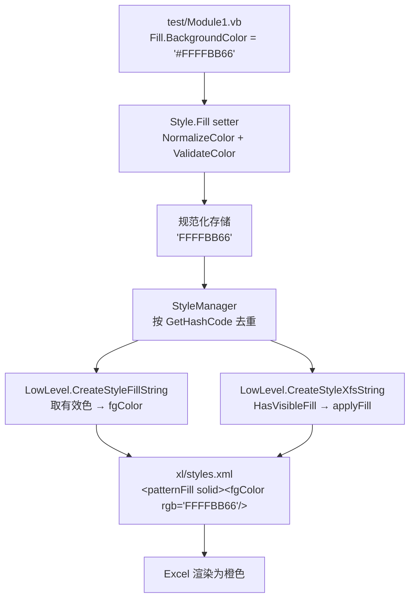

## 用户需求

修复 VB.NET 版 XLSX 写出模块的单元格填充色缺陷：在 `test/Module1.vb` 中通过 `New Style.Fill With {.BackgroundColor = "#FFFFBB66"}` 设置单元格背景色后，生成的 xlsx 在 Excel 中打开时目标单元格显示为**黑色**，而非期望的橙色 `#FFBB66`。需要审查 `XLSX/Writer` 相关代码，定位问题并给出修复方案。

## 问题概述

经代码审查，黑色背景是多处缺陷叠加导致：

1. **填充色映射错误（核心根因）**：OOXML 规范中 `patternType="solid"` 的可见颜色由 `<fgColor>` 决定、`<bgColor>` 被 Excel 忽略。而生成器固定用 `ForegroundColor` 写 `fgColor`，用户设置的 `BackgroundColor` 被完全丢弃；由于 `ForegroundColor` 默认值是 `FF000000`（黑色），最终渲染为黑色。
2. **颜色校验缺陷**：`ValidateColor` 的正则缺少首尾锚点（属子串匹配），且不接受也不规范化 CSS 风格的 `#RRGGBB` / `#AARRGGBB` 写法，用户传入的 `"#FFFFBB66"` 无法被正确处理。
3. **默认 Fill 语义污染**：`Fill.New()` 构造过程中，属性 setter 的"自动转 solid"副作用会让每个默认 Fill 都变成 `solid + 黑色`，污染默认填充项并干扰样式去重与属性合并。
4. **MRU 颜色常量误用**：字体颜色的过滤基准错误地使用了 `Fill.DEFAULT_COLOR`。

## 核心修复目标

- 设置 `BackgroundColor`（单独设置、或与 `ForegroundColor` 同时设置）后，Excel 中单元格显示正确颜色
- 颜色输入同时支持 `AARRGGBB`、`RRGGBB`、`#AARRGGBB`、`#RRGGBB` 四种写法，并自动规范化为 8 位大写 `AARRGGBB`
- 非法颜色输入给出清晰的异常提示
- 默认（未设置填充）的单元格保持无填充，不出现意外的黑色/灰色底
- 保持既有 API 向后兼容：`SetColor`、`ColorizedBackground`、`DottedFill_0_125`、边框/字体颜色等既有行为不回归
- 读写往返一致：写出的 `styles.xml` 能被本模块读取侧模型正确解析

## 验证方式

扩充 `test/Module1.vb`，覆盖单独设置背景色、同时设置前景/背景色、灰度图案填充、无填充默认单元格、以及带 `#` 前缀与不带前缀的多种颜色写法，生成文件后在 Excel 中确认颜色正确。

## 技术栈

沿用现有工程，不引入任何新依赖：

- 语言/框架：VB.NET，`xlsx-netcore5.vbproj`（.NET Core 5 目标）
- 模块来源：PicoXLSX（MIT License）的 VB.NET 移植版
- 涉及层次：
- 数据结构层 `XLSX/Writer/Style.vb`（`Style.Fill` 嵌套类、`ValidateColor`）
- XML 生成层 `XLSX/FileIO/LowLevel.vb`（`CreateStyleFillString` / `CreateMruColorsString`）
- 测试层 `test/Module1.vb`
- 现有约定：XML 通过 `StringBuilder` 手工拼接；异常统一使用 `StyleException`；样式去重依赖 `AbstractStyle.GetHashCode()`；属性合并依赖 `<Append>` 特性 + 反射 `CopyProperties`

## 根因分析

### 根因 1：solid 填充的颜色源映射错误（决定性因素）

`XLSX/FileIO/LowLevel.vb` `CreateStyleFillString()` 第 1217-1221 行：

```
If item.PatternFill = Style.Fill.PatternValue.solid Then
    sb.Append(">")
    sb.Append("<fgColor rgb=""").Append(item.ForegroundColor).Append("""/>")
    sb.Append("<bgColor indexed=""").Append(item.IndexedColor.ToString("G", culture)).Append("""/>")
    sb.Append("</patternFill>")
```

按 ECMA-376 规范，`solid` 填充时 Excel **只渲染 `fgColor`**，`bgColor` 被忽略。测试代码只设置了 `BackgroundColor`，`ForegroundColor` 仍是默认的 `FF000000`，于是写出 `<fgColor rgb="FF000000"/>` → 单元格黑色，而 `BackgroundColor` 的值被彻底丢弃。

这是「用户语义」与「OOXML 语义」的错位：用户直觉认为"背景色"就是单元格底色，但 OOXML 中 solid 的底色字段叫 `fgColor`。库内部第 2242 行 `s.CurrentFill.SetColor("FF" & rgb.ToUpper(), Fill.FillType.fillColor)` 也印证了内部约定"可见填充色 = ForegroundColor"，与用户直觉冲突。

### 根因 2：ValidateColor 校验不严 + 不支持 `#` 前缀

`XLSX/Writer/Style.vb` 第 1343-1358 行：正则 `"[a-fA-F0-9]{6,8}"` 无 `^`/ `锚点，是子串匹配，`"ZZFF0000" `之类也可能漏过；同时 9 字符的 `"#FFFFBB66"` 会被长度检查直接判为非法。

### 根因 3：默认 Fill 被 setter 副作用污染

`Fill.New()` 先设 `PatternFill = none`，随后 `ForegroundColor = DEFAULT_COLOR` 的 setter 中「若 PatternFill 为 none 则改为 solid」的逻辑被触发，导致**每个新建的默认 Fill 都是 solid + 黑色**。这会污染默认填充项，并使 `CopyProperties` 的"与全新参考对象比较"判断失真。

### 根因 4：MRU 颜色过滤跨类型误用常量

`CreateMruColorsString()` 第 1398 行用 `Style.Fill.DEFAULT_COLOR`（`"FF000000"`）过滤**字体**颜色，语义错误，会误滤掉用户真实设置的黑色字体色。

## 实施方案

### 决策 1：以 BackgroundColor 为「可见填充色」的主来源，ForegroundColor 作回退

在 `CreateStyleFillString()` 的 `solid` 分支引入颜色解析优先级：

- 若 `BackgroundColor` 有效且非默认黑 → 用它写 `fgColor`
- 否则若 `ForegroundColor` 有效 → 用它写 `fgColor`（兼容 `SetColor(..., fillColor)` 与 `ColorizedBackground` 等既有内部路径）
- 两者都无效 → 退化为 `patternType="none"` 自闭合，避免写出黑色

`bgColor` 保持 `indexed="64"`（系统默认前景/背景），符合 Excel 自身生成文件的惯例。

**为什么不改 `SetColor` 的语义**：`SetColor` 与 `ColorizedBackground`（第 2242 行）已被内置样式依赖，改动会造成大范围回归。仅在 XML 生成端做"取有效色"的收敛，是 blast radius 最小的方案，两条路径同时正确。

### 决策 2：新增颜色规范化工具，统一入口

在 `Style.Fill` 中新增共享方法（与既有 `ValidateColor` 并列，遵循同一命名与异常风格）：

- `NormalizeColor(hexCode, useAlpha, allowEmpty) As String`：剥离前导 `#`、去空白、补齐 alpha（6 位补 `FF` 前缀）、统一转大写，返回规范化后的 8 位 `AARRGGBB`
- `ValidateColor` 改为给正则加 `^`/ `锚点，并先做 `#` 剥离再校验长度，保证 `"#FFFFBB66"` 合法通过

`BackgroundColor` / `ForegroundColor` 的 setter 改为「先规范化、再校验、再存储规范化后的值」，使内存中始终是干净的 8 位大写值。这样 `GetHashCode()` 去重、MRU 颜色输出、XML 写出全部自动受益，无需在多处重复处理。

**为什么在 setter 规范化而非写出时规范化**：能让 `Fill.GetHashCode()` 对 `"#FFFFBB66"` 与 `"FFFFBB66"` 产生相同哈希，避免 StyleManager 产生重复填充项，同时保证 MRU 颜色列表输出合法值。

### 决策 3：消除默认 Fill 的 solid 污染

`Fill.New()` 改为直接赋值私有字段 `foregroundColorField` / `backgroundColorField`，绕过 setter 副作用，最后再显式设置 `PatternFill = DEFAULT_PATTERN_FILL`（none）。保证「新建的空 Fill 就是无填充」，这既是正确语义，也让 `CopyProperties` 的参考对象比较恢复准确。

同时新增 `HasVisibleFill()` 判定方法，供 XML 生成端与 `applyFill` 判断复用，避免逻辑散落（DRY）。

### 决策 4：修正 MRU 与 applyFill 判定

- `CreateMruColorsString()` 中字体颜色的过滤基准改用字体自身的默认色语义（仅按空判断），不再误用 `Fill.DEFAULT_COLOR`
- `CreateStyleXfsString()` 第 1356 行的 `applyFill` 判定复用 `HasVisibleFill()`，与填充实际写出结果保持一致，避免"声明 applyFill 但填充是 none"的不一致

## 实施要点

- **向后兼容优先**：不改动 `SetColor` / `FillType` / `ColorizedBackground` 的公开语义；`DEFAULT_COLOR` 常量保留（多处引用），仅调整其在构造与写出路径中的使用方式
- **性能**：填充数量为样式去重后的小集合（通常个位到几十），字符串拼接沿用现有 `StringBuilder`；颜色规范化为 O(n) 且 n≤9，均不构成热点。规范化放在 setter 而非循环写出中，进一步避免重复计算
- **文化无关**：颜色为纯 hex 字符串，不涉及数字格式化；其余数值输出继续沿用现有 `culture` 参数，不做改动
- **异常一致性**：所有颜色相关错误继续抛 `StyleException`，消息中包含原始输入值便于定位，不引入新异常类型
- **读写往返**：`XLSX/IO/xl/styles.xml.vb` 的 `patternFill` / `fgColor` / `bgColor` 模型无需改动，修复后写出的结构与其解析预期一致
- **回归防护**：需确认内置样式 `DottedFill_0_125`（`PatternFill = gray125`）走的是非 solid 分支，其 `fgColor` / `bgColor` 行为保持原样
- **blast radius 控制**：改动集中在 `Style.vb` 的 `Fill` 类与 `LowLevel.vb` 的两个私有生成函数，不触及 Cell/Worksheet/Workbook 与读取侧代码

## 架构与数据流



关键点：修复后 `BackgroundColor` 从设置到写出形成完整闭环，且在 setter 处即完成规范化，下游各环节共享同一份干净数据。

## 目录结构

本次为缺陷修复，仅涉及 3 个既有文件，无新增文件。

```
Excel/
├── XLSX/
│   ├── Writer/
│   │   └── Style.vb            # [MODIFY] Style.Fill 嵌套类。
│   │                           #   1) 新增 Shared NormalizeColor(hexCode, useAlpha, allowEmpty)：
│   │                           #      剥离 '#' 前缀与空白、6 位自动补 'FF' alpha、统一大写，返回 8 位 AARRGGBB；
│   │                           #      空值按 allowEmpty 决定返回空串或抛 StyleException。
│   │                           #   2) 修正 ValidateColor：正则加 ^ $ 锚点，先剥离 '#' 再校验长度，
′│   │                           #      使 '#FFFFBB66' 与 'FFFFBB66' 均合法，'ZZFF0000' 被正确拒绝。
│   │                           #   3) BackgroundColor / ForegroundColor setter 改为
│   │                           #      「先 NormalizeColor 规范化 → 再校验 → 存储规范化值」，
│   │                           #      保留原有「PatternFill 为 none 时自动转 solid」的用户可见行为。
│   │                           #   4) 修正 New() 构造：直接写私有字段 foregroundColorField /
│   │                           #      backgroundColorField，绕开 setter 副作用，末尾显式设
│   │                           #      PatternFill = DEFAULT_PATTERN_FILL(none)，确保默认 Fill 为无填充。
│   │                           #   5) 新增 HasVisibleFill() As Boolean：判定是否存在应写出的有效填充
│   │                           #      （PatternFill <> none 且至少一个颜色有效非默认黑），供写出端复用。
│   │                           #   保持 SetColor / FillType / DEFAULT_COLOR / GetHashCode / Copy 的既有契约。
│   └── FileIO/
│       └── LowLevel.vb         # [MODIFY] styles.xml 生成逻辑。
│                               #   1) CreateStyleFillString()：solid 分支改为按
│                               #      BackgroundColor → ForegroundColor 的优先级取「可见填充色」写入 fgColor，
│                               #      bgColor 继续输出 indexed="64"；两者均无效时退化为 patternType="none" 自闭合，
│                               #      杜绝写出黑色。灰度图案分支（darkGray/mediumGray/lightGray/gray0625）
│                               #      保持既有 fgColor/bgColor 语义不变。
│                               #   2) CreateStyleXfsString()：applyFill 判定复用 Fill.HasVisibleFill()，
│                               #      与实际写出的填充保持一致。
│                               #   3) CreateMruColorsString()：字体颜色过滤不再误用 Style.Fill.DEFAULT_COLOR，
│                               #      改为仅按空值过滤；填充颜色沿用有效色判定，确保 mruColors 只含合法 8 位值。
└── test/
    └── Module1.vb              # [MODIFY] 扩充 testWriter 验证用例，覆盖：
                                #   单独设置 BackgroundColor（带 '#' 前缀，回归原始问题场景）；
                                #   不带 '#' 前缀的 8 位与 6 位颜色写法；
                                #   同时设置 Foreground 与 Background；
                                #   灰度图案填充（gray125 等非 solid）；
                                #   未设置任何填充的默认单元格（应无底色）。
                                #   保持既有 zip_test 不变。
```

## 关键接口

仅列出新增的两个核心契约（签名级，不含实现）：

```
' Style.Fill 内新增
''' 规范化颜色字符串：剥离 '#'、补齐 alpha、统一大写，返回 AARRGGBB
Public Shared Function NormalizeColor(hexCode As String, useAlpha As Boolean, Optional allowEmpty As Boolean = False) As String

''' 判定该 Fill 是否存在需要写出的可见填充
Public Function HasVisibleFill() As Boolean
```

## Agent Extensions

### SubAgent

- **code-explorer**
- Purpose: 在动手修改前，跨 `XLSX/Writer`、`XLSX/FileIO`、`XLSX/IO` 全量检索所有对 `ForegroundColor`、`BackgroundColor`、`DEFAULT_COLOR`、`ValidateColor`、`SetColor`、`PatternFill` 的引用点与调用链，确认内置样式（`ColorizedBackground`、`DottedFill_0_125`、`BorderFrame` 等）及读取侧模型受影响范围。
- Expected outcome: 输出完整的引用点清单与回归风险清单，确保修复不遗漏调用方、不破坏既有内置样式行为。