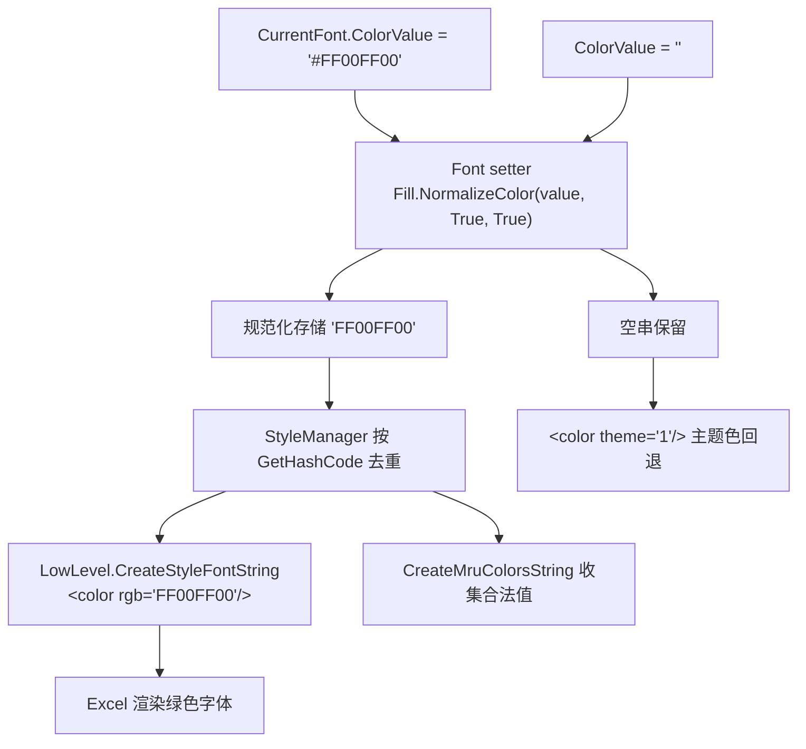

## 用户需求

用户报告：在 `test/Module1.vb` 中设置 `ForegroundColor` 后，生成的 xlsx 在 Excel 中打开，该颜色被应用到了**单元格背景**，而**字体颜色仍为黑色**，无法设置字体颜色。要求基于最新代码审查并修复。

## 问题澄清

用户观察到的现象由两个独立问题构成：

### 其一：属性语义混淆（非代码缺陷）

`Fill.ForegroundColor` 并非字体颜色。在 OOXML 中它是**填充图案的前景色**，对 `solid` 填充而言即单元格底色。字体颜色的正确入口是 `Font.ColorValue`。

用户测试代码只设置了 `CurrentFill`，未触碰 `CurrentFont`，因此绿色被正确当作填充色、字体保持默认黑色 —— 程序行为与代码字面要求一致。

### 其二：字体颜色链路存在真实缺陷（本轮修复重点）

即便用户改用正确的 `CurrentFont.ColorValue = "#FF00FF00"`，当前代码**依然会渲染为黑色**。原因是上一轮仅对 `Fill` 做了颜色规范化，`Font.ColorValue` 的 setter 只做校验、不做规范化，带 `#` 的原始字符串被直接存入并写出为非法的 `<color rgb="#FF00FF00"/>`，Excel 忽略后回退黑色。

同一缺陷模式还波及边框颜色与 MRU 颜色列表。

## 核心目标

- 字体颜色可正常设置并在 Excel 中正确渲染
- 字体、边框、MRU 颜色统一支持 `AARRGGBB` / `RRGGBB` / `#AARRGGBB` / `#RRGGBB` 四种写法，自动规范化为 8 位大写
- 空值语义保留：字体颜色为空表示改用主题色，边框颜色为空表示未设置
- 修正 `Font.Name` setter 的校验笔误
- 不回归上一轮已验证通过的填充色行为，内置样式保持兼容
- 在测试中补充字体颜色用例，并纠正用户对属性语义的误用示范

## 验证方式

扩充测试覆盖字体颜色的多种写法、字体色与背景色组合、主题色回退、边框颜色，生成文件后核对 `xl/styles.xml` 中 `<font>` 内的 `<color rgb>` 均为合法 8 位值，并在 Excel 中确认字体实际着色。

## 技术栈

沿用现有工程，不引入新依赖：

- 语言/框架：VB.NET，`xlsx-netcore5.vbproj`（实测 `TargetFramework=net10.0`）
- 模块来源：PicoXLSX（MIT）的 VB.NET 移植版
- 命名空间：`Microsoft.VisualBasic.MIME.Office.Excel.XLSX.Writer.Styling`
- 现状：样式类已由单一 `Style.vb` 拆分为 `XLSX/Writer/Style/` 目录，`Fill` / `Font` / `Border` / `PatternValue` 等均为顶层类型

## 根因分析

### 根因：颜色规范化只覆盖了 Fill，未覆盖 Font / Border / MRU

上一轮在 `Fill` 中引入 `NormalizeColor()`（剥离 `#`、6 位补 `FF`、转大写、锚点校验），并让 `Fill` 的 setter 存储**规范化后的值**。同时把 `ValidateColor` 改为薄封装：

```
Public Shared Sub ValidateColor(hexCode As String, useAlpha As Boolean, Optional allowEmpty As Boolean = False)
    NormalizeColor(hexCode, useAlpha, allowEmpty)
End Sub
```

关键点：`ValidateColor` 是 `Sub`，**丢弃了 `NormalizeColor` 的返回值**，只保留校验副作用。

而 `Font.ColorValue`（`Font.vb` 第 116-119 行）仍是旧写法：

```
Set(value As String)
    Fill.ValidateColor(value, True, True)
    colorValueField = value
End Set
```

`"#FF00FF00"` 通过校验（因 `NormalizeColor` 已能接受 `#`），但存入字段的是**未规范化的 9 字符原值**。写出端 `LowLevel.vb` 第 1186-1190 行直接拼接：

```
sb.Append("<color rgb=""").Append(item.ColorValue).Append("""/>")
```

产出 `<color rgb="#FF00FF00"/>` —— 非法 OOXML，Excel 忽略并回退黑色。6 位写法 `"00FF00"` 同样不会被补齐为 `"FF00FF00"`。

这解释了为什么修复填充色后字体色仍然不可用：**规范化逻辑存在但未接入字体链路**。

### 同源缺陷的扩散面

`Border.vb` 的 5 个颜色属性（`BottomColor` / `TopColor` / `LeftColor` / `RightColor` / `DiagonalColor`，第 55/75/109/129/149 行）用的是完全相同的「只校验不规范化」写法，会写出非法边框颜色。

`Workbook.AddMruColor`（第 301-307 行）手工做了 6 位补 `FF` 和 `ToUpper()`，但**未剥离 `#`**，属于逻辑重复且不完整。

### 附带缺陷：Font.Name setter 校验错变量

`Font.vb` 第 149-154 行校验的是 `nameField`（旧值）而非 `value`（新值）：空字符串可被写入，而字段为空时合法赋值反而抛异常。因 `nameField` 声明处有初始值 `DEFAULT_FONT_NAME`，当前未暴露为崩溃，但逻辑确实是错的。

## 实施方案

### 决策 1：新增 `NormalizeColor` 的 Function 形态复用，setter 统一存规范化值

`Fill.NormalizeColor` 已是 `Public Shared Function` 且签名完备，直接复用，**不新增任何工具方法**。

- `Font.ColorValue` setter 改为 `colorValueField = Fill.NormalizeColor(value, True, True)`
- `Border` 的 5 个颜色 setter 同样改为存储 `Fill.NormalizeColor(value, True, True)`

保留 `allowEmpty:=True`：`NormalizeColor` 对空输入返回 `String.Empty`，恰好维持「字体空值 → 走 `ColorTheme`」「边框空值 → 未设置」的既有语义，写出端的 `String.IsNullOrEmpty` 判断无需改动。

**为何在 setter 而非写出端规范化**：与上一轮 `Fill` 的做法保持一致（SoC + DRY）。规范化后 `GetHashCode()` 对 `"#FF00FF00"` 与 `"FF00FF00"` 产生相同哈希，避免 `StyleManager` 产生重复字体/边框条目；`mruColors` 收集与 XML 写出也自动获得合法值，无需在多处重复处理。

### 决策 2：`AddMruColor` 复用 `NormalizeColor`，消除重复逻辑

将手工的 6 位补齐 + `ToUpper()` 替换为 `mruColors.Add(Fill.NormalizeColor(color, True))`，顺带获得 `#` 剥离能力，行为向后兼容（原本合法的输入结果不变）。

### 决策 3：修正 `Font.Name` 校验变量

`If String.IsNullOrEmpty(nameField)` 改为 `If String.IsNullOrEmpty(value)`。属最小化笔误修正，不改变对外契约。

### 决策 4：测试中同时演示正确用法与纠正误用

在 `test/Module1.vb` 中：

- 把第 64 行用户误用的 `CurrentFill.ForegroundColor` 示例改为同时演示「字体色」与「填充色」的正确写法，并加注释说明二者区别
- 新增 `testFontColors` 工作表，覆盖字体颜色的四种写法、字体色+背景色组合、主题色回退（空 `ColorValue`）、内置 `ColorizedText`、以及边框颜色

## 实施要点

- **向后兼容**：`ValidateColor` 保持 `Sub` 签名不变（`BasicStyles.vb` 第 249/261 行、`Workbook.vb` 第 305 行等处仍在调用）；`DEFAULT_COLOR` 等常量不动；`ColorizedText` / `ColorizedBackground` 行为不变（其传入的已是合法 6 位值，经规范化后结果一致）
- **不回归填充色**：本轮不触碰 `Fill` 的任何已验证逻辑，也不改动 `CreateStyleFillString` / `GetEffectiveFillColor` / `HasVisibleFill`
- **`IsDefaultFont` 语义**：`Font.New()` 中 `ColorValue = String.Empty` 经 `NormalizeColor(allowEmpty:=True)` 仍返回空串，`IsDefaultFont`（与 `New Font()` 比较）与 `applyFont` 判定行为不变
- **性能**：字体/边框数量为样式去重后的小集合，`NormalizeColor` 为 O(n) 且 n≤9，且移到 setter 后避免了写出循环中的重复计算，无热点
- **异常一致性**：所有颜色错误继续抛 `StyleException`，消息含原始输入值
- **blast radius**：改动集中在 `Font.vb`（2 处）、`Border.vb`（5 处同构）、`Workbook.vb`（1 处）、`test/Module1.vb`；不触及 `LowLevel.vb` 写出逻辑与读取侧模型

## 数据流



## 目录结构

本轮为缺陷修复，仅涉及 4 个既有文件，无新增文件。

```
Excel/
├── XLSX/
│   └── Writer/
│       ├── Style/
│       │   ├── Font.vb        # [MODIFY] 字体样式类。
│       │   #   1) ColorValue setter（第 116-119 行）改为
│       │   #      colorValueField = Fill.NormalizeColor(value, True, True)，
│       │   #      使 '#FF00FF00' / '00FF00' / 小写写法均规范化为 8 位大写 AARRGGBB，
│       │   #      彻底修复写出非法 <color rgb="#..."/> 导致字体回退黑色的问题；
│       │   #      保留 allowEmpty:=True 以维持「空值 → 使用 ColorTheme」语义。
│       │   #   2) Name setter（第 149-154 行）把 String.IsNullOrEmpty(nameField)
│       │   #      修正为 String.IsNullOrEmpty(value)，校验新值而非旧值。
│       │   #   不改动 New()、Copy()、GetHashCode()、IsDefaultFont 的既有契约。
│       │   └── Border.vb      # [MODIFY] 边框样式类。
│       │       #   BottomColor / DiagonalColor / LeftColor / RightColor / TopColor
│       │       #   五个 setter（第 55/75/109/129/149 行）统一改为存储
│       │       #   Fill.NormalizeColor(value, True, True) 的返回值，
│       │       #   修复同源的「只校验不规范化」缺陷；空值语义保持不变。
│       └── Workbook.vb        # [MODIFY] AddMruColor（第 301-307 行）以
│                              #   Fill.NormalizeColor(color, True) 替换手工的
│                              #   6 位补 FF + ToUpper 逻辑，消除重复实现并
│                              #   补齐 '#' 前缀剥离能力，行为向后兼容。
└── test/
    └── Module1.vb             # [MODIFY] 测试用例。
                               #   1) 修正第 64 行对 Fill.ForegroundColor 的误用示范，
                               #      改为并列演示 CurrentFont.ColorValue（字体色）与
                               #      CurrentFill.BackgroundColor（填充色），加注释说明区别。
                               #   2) 新增 testFontColors 工作表，覆盖：
                               #      #FF00FF00 / 00FF00 / 小写 / 8 位四种字体色写法；
                               #      字体色 + 背景色组合（验证互不干扰）；
                               #      未设 ColorValue 的默认字体（应走 theme 主题色）；
                               #      内置 BasicStyles.ColorizedText 兼容性；
                               #      边框颜色带 '#' 前缀的写法。
                               #   保持既有 testFillColors 与 zip_test 不变。
```

## Agent Extensions

### SubAgent

- **code-explorer**
- Purpose: 在修改前跨 `XLSX/Writer/Style`、`XLSX/FileIO`、`XLSX/IO` 检索所有仍以「只调用 `ValidateColor` 校验、随后存储原始值」模式处理颜色的位置，确认除已识别的 `Font.ColorValue`、`Border` 五个颜色属性、`Workbook.AddMruColor` 之外无其他遗漏点，并核对 `BasicStyles` 内置样式与读取侧模型的受影响范围。
- Expected outcome: 输出完整的「未规范化颜色写入点」清单与回归风险清单，确保本轮修复覆盖全部同源缺陷、不遗漏调用方、不破坏内置样式行为。