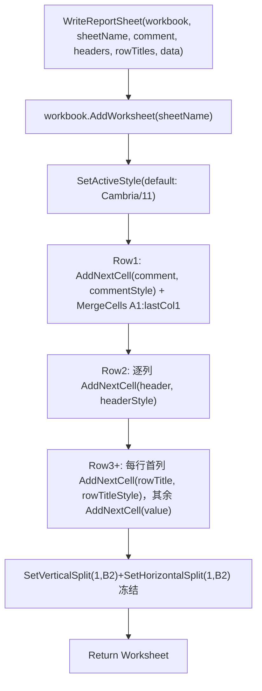

## 用户需求

用户将基于该 VB.NET XLSX 生成模块开发科研数据自动化报表工具，需要一个可复用的函数，向某个工作表写入符合下列规范的表格数据：

## 核心特性

- 第一行为注释信息行：白色背景、草绿色字体、斜体、整行所有单元格合并、靠左对齐。
- 第二行为列标题行：深蓝色背景、白色字体、加粗。
- 第三行起为表格正文：使用默认样式。
- 表格第一列为行标题：斜体、深灰色字体。
- 以“第一列、第二行（B2）”为锚点冻结首行与首列（freeze panel）。
- 整张表格默认字体为 Cambria，默认字号为 11 号。

## 技术栈

- 沿用现有工程：VB.NET，命名空间 `Microsoft.VisualBasic.MIME.Office.Excel.XLSX.Writer`（及 `.Styling`）。
- 不引入新依赖，仅新增一个可复用函数/模块，不修改库现有代码（blast radius 仅为新增 `test/ReportHelper.vb` 与 `test/Module1.vb` 的调用示例）。

## 实现方案

### 策略

新建一个 `ReportHelper` 静态模块，暴露 `WriteReportSheet` 函数，内部按“默认样式激活 → 注释行 → 列标题行 → 正文行 → 冻结窗格”的顺序复用既有 `Workbook`/`Worksheet`/`Style` 公共 API 完成写入。所有颜色通过上一轮已修复的规范化通道（`Font.ColorValue` / `Fill.BackgroundColor`）写入，确保输出合法 8 位 OOXML 值。

### 关键技术决策

1. **整表默认字体/字号**：构造一个默认 `Style`（`CurrentFont.Name="Cambria"`, `Size=11.0F`），调用 `Worksheet.SetActiveStyle` 激活。之后正文用 `AddNextCell(value)`（不带样式）即自动继承 Cambria/11，避免逐单元格重复设置字体，减少样式条目与 XML 体积（SoC + DRY）。
2. **注释行合并**：先向 `A1` 写入带草绿斜体白底左对齐样式的单元格，再用 `MergeCells("A1:" & lastColLetter & "1")` 合并整行。PicoXLSX 合并行为仅首格保留值与样式，符合需求。
3. **列标题行**：对每个 header 用 `深蓝底(1F4E78) + 白字(FFFFFFFF) + Bold` 样式写入。
4. **行标题列**：正文每行首列用 `斜体 + 深灰字(595959)` 样式，其余单元格走默认样式。
5. **冻结窗格**：以 `B2` 为锚点，同时调用 `SetVerticalSplit(1, True, New Address("B2"), WorksheetPane.bottomRight)` 与 `SetHorizontalSplit(1, True, New Address("B2"), WorksheetPane.bottomRight)`，冻结首列与首行。

### 兼容性说明

- `Fill.BackgroundColor` setter 会自动将 `PatternFill` 由 `none` 提升为 `solid`，solid 填充可见色取自 `BackgroundColor`，无需手动设置 PatternValue。
- `Font.ColorValue` 已规范化（接受 `#AARRGGBB`/`RRGGBB`/`#RRGGBB`/`AARRGGBB`），直接传入 `#70AD47`、`#1F4E78`、`#FFFFFFFF`、`#595959` 即可。
- `Address` 构造：`New Address("B2")`（type 可选，默认 Default）。

### 性能

- 顺序 `AddNextCell` 写入，O(行×列)；样式对象在各行复用同一实例，经 `StyleRepository` 去重，不会产生样式爆炸。
- 无热点路径，规模远小于 Excel 行/列上限。

## 实施要点

- 保持 `ValidateColor`/`NormalizeColor` 既有语义，颜色串统一带 `#` 传入。
- 注释行颜色草绿取 `#70AD47`；列标题深蓝取 `#1F4E78`；行标题深灰取 `#595959`（如需调整颜色常量集中定义便于复用）。
- 函数返回 `Worksheet` 以便调用方继续追加内容或保存。

## 架构设计



## 目录结构

```
Excel/
├── test/
│   ├── ReportHelper.vb   # [NEW] 报表写入辅助模块。
│   │   #   定义 WriteReportSheet 函数：接收 Workbook、sheetName、commentText、
│   │   #   headers(IEnumerable(Of String))、rowTitles(IEnumerable(Of String))、
│   │   #   data(IEnumerable(Of IEnumerable(Of Object)))。
│   │   #   内部复用 SetActiveStyle / AddNextCell / MergeCells / SetVerticalSplit /
│   │   #   SetHorizontalSplit 完成注释行、列标题行、正文行与冻结窗格；
│   │   #   颜色常量（草绿/深蓝/白/深灰）集中定义；返回 Worksheet。
│   └── Module1.vb        # [MODIFY] 在 testWriter 中调用 WriteReportSheet 生成一张
│                          #   示例报表 sheet，便于编译验证与 zip 校验 styles.xml。
```

## 关键代码结构

```
Public Module ReportHelper
    Private ReadOnly COLOR_COMMENT_FONT As String = "#70AD47"   ' 草绿
    Private ReadOnly COLOR_HEADER_FILL  As String = "#1F4E78"   ' 深蓝
    Private ReadOnly COLOR_HEADER_FONT  As String = "#FFFFFFFF" ' 白
    Private ReadOnly COLOR_ROWTITLE_FONT As String = "#595959"  ' 深灰

    Public Function WriteReportSheet(workbook As Workbook,
                                     sheetName As String,
                                     commentText As String,
                                     headers As IEnumerable(Of String),
                                     rowTitles As IEnumerable(Of String),
                                     data As IEnumerable(Of IEnumerable(Of Object))) As Worksheet
        ' 1) 默认样式 Cambria/11 通过 SetActiveStyle 激活
        ' 2) 注释行：白底 + 草绿斜体 + 左对齐，合并 A1:lastCol1
        ' 3) 列标题行：深蓝底 + 白字 + 加粗
        ' 4) 正文：首列斜体深灰行标题，其余走默认样式
        ' 5) 冻结：SetVerticalSplit(1,True,New Address("B2"),WorksheetPane.bottomRight)
        '         SetHorizontalSplit(1,True,New Address("B2"),WorksheetPane.bottomRight)
    End Function
End Module
```