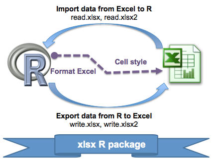
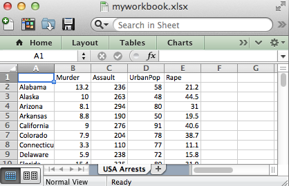
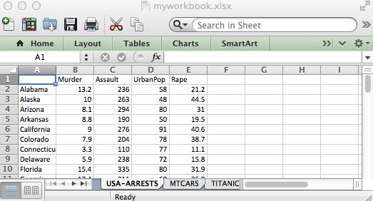
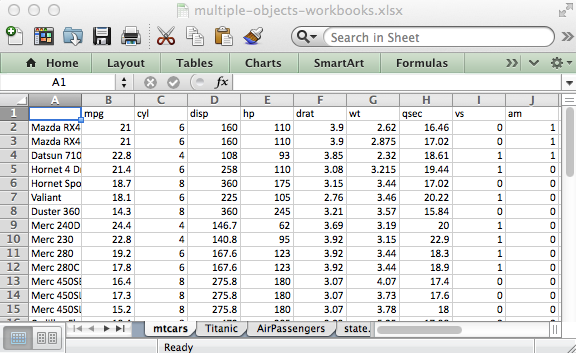
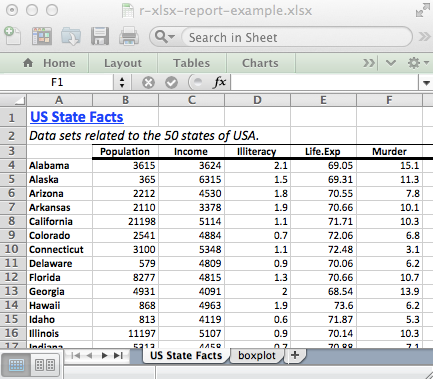
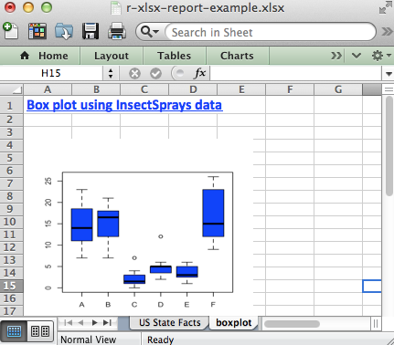

# R xlsx package: A quick start guide to manipulate Excel files in R

> http://www.sthda.com/english/wiki/r-xlsx-package-a-quick-start-guide-to-manipulate-excel-files-in-r


> Read and write excel file using R, xlsx package

There are many solutions to import and export Excel files using R software. The different ways to connect R and Excel has been already discussed in our previous article [R Excel essentials: Read, write and format Excel files using R].

xlsx package is one of the powerful R packages to read, write and format Excel files. It is a java-based solution and it is available for Windows, Mac and Linux. It works for both Excel 2007 and Excel 97/2000/XP/2003 file formats (xls and xlsx file formats).

Unfortunately the xlsx package is not especially well documented.

> This article is a quick start guide to manipulate Excel files in R using xlsx package .

In this tutorial, you will learn how to use xlsx package to :

+ Read and write Excel files
+ Add data sets and images (or plots) into an Excel worksheet
+ Format the appearance of the Excel worksheet by setting data formats, fonts, colors and borders

## Install and load xlsx package

```R
install.packages("xlsx")
library("xlsx")
```

> Note that, xlsx packages depends on rJava and xlsxjars R packages.

## Read an Excel file

The R functions ``read.xlsx()`` and ``read.xlsx2()`` can be used to read the contents of an Excel worksheet into an R data.frame.

The difference between these two functions is that :

+ ``read.xlsx`` preserves the data type. It tries to guess the class type of the variable corresponding to each column in the worksheet. Note that, ``read.xlsx`` function is slow for large data sets (worksheet with more than 100 000 cells).
+ ``read.xlsx2`` is faster on big files compared to ``read.xlsx`` function.

The simplified formats of these two functions are:

```R
read.xlsx(file, sheetIndex, header=TRUE, colClasses=NA)
read.xlsx2(file, sheetIndex, header=TRUE, colClasses="character")
```

+ file : the path to the file to read
+ sheetIndex : a number indicating the index of the sheet to read; e.g : use sheetIndex=1 to read the first sheet
+ header : a logical value. If TRUE, the first row is used as the names of the variables
+ colClasses : a character vector that represents the class of each column

Examples :

```R
library(xlsx)
file <- system.file("tests", "test_import.xlsx", package = "xlsx")
res <- read.xlsx(file, 1)  # read first sheet
head(res[, 1:6])
#          NA. Population Income Illiteracy Life.Exp Murder
# 1    Alabama       3615   3624        2.1    69.05   15.1
# 2     Alaska        365   6315        1.5    69.31   11.3
# 3    Arizona       2212   4530        1.8    70.55    7.8
# 4   Arkansas       2110   3378        1.9    70.66   10.1
# 5 California      21198   5114        1.1    71.71   10.3
# 6   Colorado       2541   4884        0.7    72.06    6.8
```

> Note that read.xlsx and read.xlsx2 functions can be used to read both .xls and .xlsx file formats.

## Write data to an Excel file

The R functions write.xlsx() and write.xlsx2() can be used to export data from R to an Excel workbook. Note that write.xlsx2 achieves better performance compared to write.xlsx for very large data.frame (with more than 100 000 cells).

The simplified formats of these two functions are:

```R
write.xlsx(x, file, sheetName="Sheet1", 
  col.names=TRUE, row.names=TRUE, append=FALSE)
write.xlsx2(x, file, sheetName="Sheet1",
  col.names=TRUE, row.names=TRUE, append=FALSE)
```

+ x : a data.frame to be written into the workbook
+ file : the path to the output file
+ sheetName : a character string to use for the sheet name.
+ col.names, row.names : a logical value specifying whether the column names/row names of x are to be written to the file
+ append : a logical value indicating if x should be appended to an existing file.

Examples :

```R
library(xlsx)
write.xlsx(USArrests, file="myworkbook.xlsx", 
           sheetName="USA Arrests")
```

Note that, the above code saves the Excel file in your current working directory.


> Read and write excel file using R and xlsx package

To add multiple data sets in the same Excel workbook, you have to use the argument append = TRUE. This is illustrated in the following R code :

```R
# Write the first data set in a new workbook
write.xlsx(USArrests, file="myworkbook.xlsx",
      sheetName="USA-ARRESTS", append=FALSE)
# Add a second data set in a new worksheet
write.xlsx(mtcars, file="myworkbook.xlsx", sheetName="MTCARS", 
           append=TRUE)
# Add a third data set
write.xlsx(Titanic, file="myworkbook.xlsx", sheetName="TITANIC", 
           append=TRUE)
```


> Read and write excel file using R and xlsx package

As you can see from the image above, it’s possible to add multiple data sets in the same Excel file. However, the method is very repetitive. You will find in the next section a simple function to add different types of data in a single call.

## Simple R function to export quickly multiple data sets to the same Excel workbook

This section provides an R function to easily export multiple R objects to an Excel Workbook in a single call. The different objects (data) are written in different worksheets from the same Excel workbook. The object names are used for naming the different sheets.

The R code of the function is :

```R
#+++++++++++++++++++++++++++
# xlsx.writeMultipleData
#+++++++++++++++++++++++++++++
# file : the path to the output file
# ... : a list of data to write to the workbook
xlsx.writeMultipleData <- function (file, ...)
  {
    require(xlsx, quietly = TRUE)
    objects <- list(...)
    fargs <- as.list(match.call(expand.dots = TRUE))
    objnames <- as.character(fargs)[-c(1, 2)]
    nobjects <- length(objects)
    for (i in 1:nobjects) {
        if (i == 1)
            write.xlsx(objects[[i]], file, sheetName = objnames[i])
        else write.xlsx(objects[[i]], file, sheetName = objnames[i],
            append = TRUE)
    }
  }
```

This function is inspired from the one published on statmethods website

The function xlsx.writeMultipleData works for data frames, matrices, time series, and tables.

Example of usage :

Use the R code below to save mtcars (a data frame), Titanic (a table), AirPassengers (a time series) and state.x77 (a matrix) :

```R
xlsx.writeMultipleData("myworkbook.xlsx",
        mtcars, Titanic, AirPassengers, state.x77)
```


> Read and write excel file using R, multiple objects in the same Excel workbook

## Create and format a nice Excel workbook

The function write.xlsx() is useful when you want just to write a data.frame to an xlsx file. The goal of this section is to show you how to create a nice Excel report containing a formatted data table and plots.

The following steps are required :

1. Create a workbook
2. Define some cell styles : Font color and size, text alignment, border and data format, …
3. Write a table into an Excel spreadsheet using the defined styles in step 2.
4. Save the workbook to a file
5. Open and view the resulting workbook

> In the next sections, I will show you step by step how to change the appearance of Excel worksheet in R. Note that, formatting Excel worksheets using xlsx R package requires some hard coding. This is why, I recently implemented the r2excel package which depends on xlsx package and it provides an easy to use functions to quickly import data from Excel files and to create a nice Excel report. r2excel package is described in my previous post : R Excel essentials : Read, write and format Excel files using R

### Step 1/5. Create a new Excel workbook

The function createWorkbook() can be used. It works for both .xls and .xlsx file formats.

```R
# create a new workbook for outputs
# possible values for type are : "xls" and "xlsx"
wb<-createWorkbook(type="xlsx")
```

### Step 2/5. Define some cell styles for formating the workbook

We’ll define some cell styles to change :

+ the appearance of the sheet title
+ the appearance of the row and column names of the data table
+ the text alignment for the table column names
+ the cell borders around the column names

The R function CellStyle() can be used to create cell styles. A simplified format of the function is :

```R
CellStyle(wb, dataFormat=NULL, alignment=NULL,
          border=NULL, fill=NULL, font=NULL)
```

+ wb : a workbook object as returned by createWorkbook or loadWorkbook.
+ dataFormat : a DataFormat object
+ alignment : a Alignment object
+ border : a Border object
+ font : a Font object

```R
# Define some cell styles
#++++++++++++++++++++
# Title and sub title styles
TITLE_STYLE <- CellStyle(wb)+ Font(wb,  heightInPoints=16, 
                            color="blue", isBold=TRUE, underline=1)
SUB_TITLE_STYLE <- CellStyle(wb) + 
                    Font(wb,  heightInPoints=14, 
                          isItalic=TRUE, isBold=FALSE)
# Styles for the data table row/column names
TABLE_ROWNAMES_STYLE <- CellStyle(wb) + Font(wb, isBold=TRUE)
TABLE_COLNAMES_STYLE <- CellStyle(wb) + Font(wb, isBold=TRUE) +
    Alignment(wrapText=TRUE, horizontal="ALIGN_CENTER") +
    Border(color="black", position=c("TOP", "BOTTOM"), 
           pen=c("BORDER_THIN", "BORDER_THICK")) 
```

1. wb : a workbook object as returned by createWorkbook or loadWorkbook.
2. The main arguments for Font() function :
   + color : font color
   + heightInPoints : font size. Usual values are 10, 12, 14, etc
   + isBold, isItalic : a logical indicating whether the font should be bold or italic
   + underline : an integer specifying the thickness of the underline. Possible values are 0, 1, 2.
   + name : the font to use; e.g: “Courier New”.
3. The main arguments for Alignment() function :
   + wrapText : a logical indicating whether the text should be wrapped.
   + horizontal : the horizontal alignment. Possible values are : “ALIGN_CENTER”, “ALIGN_JUSTIFY”, “ALIGN_LEFT”, “ALIGN_RIGHT”.
   + vertical : the vertical alignment. Possible values are : “VERTICAL_BOTTOM”, “VERTICAL_CENTER”, “VERTICAL_JUSTIFY”, “VERTICAL_TOP”
   + rotation : a numerical value specifying the degrees you want to rotate the text in the cell. Default value is 0.
4. The main arguments for Border() function :
   + color : the border color; e.g : color=“red” or color =“#FF0000”
   + position : the border position. Allowed values are : “BOTTOM”, “LEFT”, “TOP”, “RIGHT”
   + pen : the pen style. Allowed values are : “BORDER_DASH_DOT”, “BORDER_DASH_DOT_DOT”, “BORDER_DASHED”, “BORDER_DOTTED”, “BORDER_DOUBLE”, “BORDER_HAIR”, “BORDER_MEDIUM”, “BORDER_MEDIUM_DASH_DOT”, “BORDER_MEDIUM_DASH_DOT_DOT”, “BORDER_MEDIUM_DASHED”, “BORDER_NONE”, “BORDER_SLANTED_DASH_DOT”, “BORDER_THICK”, “BORDER_THIN”.

### Step 3/5. Write data and plots into the workbook

#### Create a new sheet in the workbook

To add data, the first step is to create a sheet in the workbook to contain the data. This can be done using the function creatSheet() :

```R
# Create a new sheet in the workbook
sheet <- createSheet(wb, sheetName = "US State Facts")
```

#### Add a title into a worksheet

To add a title, the procedure is :

1. create a new row
2. create a cell in this row to contain the title.
3. set the cell value.

To simplify the R code, I wrote a helper function for adding a title :

```R
#++++++++++++++++++++++++
# Helper function to add titles
#++++++++++++++++++++++++
# - sheet : sheet object to contain the title
# - rowIndex : numeric value indicating the row to 
  #contain the title
# - title : the text to use as title
# - titleStyle : style object to use for title
xlsx.addTitle<-function(sheet, rowIndex, title, titleStyle){
  rows <-createRow(sheet,rowIndex=rowIndex)
  sheetTitle <-createCell(rows, colIndex=1)
  setCellValue(sheetTitle[[1,1]], title)
  setCellStyle(sheetTitle[[1,1]], titleStyle)
}
```

> Copy and paste the code of the function xlsx.addTitle into your R console before continuing.

```R
# Add title
xlsx.addTitle(sheet, rowIndex=1, title="US State Facts",
      titleStyle = TITLE_STYLE)
# Add sub title
xlsx.addTitle(sheet, rowIndex=2, 
      title="Data sets related to the 50 states of USA.",
      titleStyle = SUB_TITLE_STYLE)
```

#### Add a table into a worksheet

The function addDataframe() can be used to add the table in the new sheet.

state.x77 data table is used in the following example :

```R
head(state.x77)
#            Population Income Illiteracy Life Exp Murder HS Grad Frost   Area
# Alabama          3615   3624        2.1    69.05   15.1    41.3    20  50708
# Alaska            365   6315        1.5    69.31   11.3    66.7   152 566432
# Arizona          2212   4530        1.8    70.55    7.8    58.1    15 113417
# Arkansas         2110   3378        1.9    70.66   10.1    39.9    65  51945
# California      21198   5114        1.1    71.71   10.3    62.6    20 156361
# Colorado         2541   4884        0.7    72.06    6.8    63.9   166 103766
```

```R
# Add a table
addDataFrame(state.x77, sheet, startRow=3, startColumn=1, 
             colnamesStyle = TABLE_COLNAMES_STYLE,
             rownamesStyle = TABLE_ROWNAMES_STYLE)
# Change column width
setColumnWidth(sheet, colIndex=c(1:ncol(state.x77)), colWidth=11)
```

+ Arguments for addDataFrame() function :
   + startRow, startColumn : a numeric value indicating the starting row and column
   + colnameStyle, rownameStyle : A CellStyle object to customize the table header and row names
+ Arguments for setColumnWidth() function :
   + colIndex : a numeric vector indicating the columns you want to change the size.
   + colWidth : the width of the column

#### Add a plot into an Excel worksheet

```R
# create a png plot
png("boxplot.png", height=800, width=800, res=250, pointsize=8)
boxplot(count ~ spray, data = InsectSprays,
         col = "blue")
dev.off()
# Create a new sheet to contain the plot
sheet <-createSheet(wb, sheetName = "boxplot")
# Add a title to the sheet
xlsx.addTitle(sheet, rowIndex=1, 
              title="Box plot using InsectSprays data",
              titleStyle = TITLE_STYLE)
# Add the plot created previously
addPicture("boxplot.png", sheet, scale = 1, startRow = 4,
          startColumn = 1)
# Remove the plot from the disk
res<-file.remove("boxplot.png")
```

### Step 4/5. Save the Excel workbook to the disk

```R
# Save the workbook to a file
saveWorkbook(wb, "r-xlsx-report-example.xlsx")
```

### Step 5/5. Open and view the resulting Excel workbook

Go to your current working directory and open the created workbook.



> Read and write excel file using R and xlsx package Read and write excel file using R and xlsx package

As mentioned above, formatting Excel worksheets can be done easily and quickly using r2excel package. r2excel package is described in my previous post : R Excel essentials : Read, write and format Excel files using R

## The complete R script to create a nice Excel report

The complete R script to create the workbook above is :

```R
library(xlsx)
# create a new workbook for outputs
#++++++++++++++++++++++++++++++++++++
# possible values for type are : "xls" and "xlsx"
wb<-createWorkbook(type="xlsx")
# Define some cell styles
#++++++++++++++++++++++++++++++++++++
# Title and sub title styles
TITLE_STYLE <- CellStyle(wb)+ Font(wb,  heightInPoints=16, 
                                   color="blue", isBold=TRUE, underline=1)
SUB_TITLE_STYLE <- CellStyle(wb) + 
  Font(wb,  heightInPoints=14,
       isItalic=TRUE, isBold=FALSE)
# Styles for the data table row/column names
TABLE_ROWNAMES_STYLE <- CellStyle(wb) + Font(wb, isBold=TRUE)
TABLE_COLNAMES_STYLE <- CellStyle(wb) + Font(wb, isBold=TRUE) +
  Alignment(wrapText=TRUE, horizontal="ALIGN_CENTER") +
  Border(color="black", position=c("TOP", "BOTTOM"), 
         pen=c("BORDER_THIN", "BORDER_THICK")) 
# Create a new sheet in the workbook
#++++++++++++++++++++++++++++++++++++
sheet <- createSheet(wb, sheetName = "US State Facts")
#++++++++++++++++++++++++
# Helper function to add titles
#++++++++++++++++++++++++
# - sheet : sheet object to contain the title
# - rowIndex : numeric value indicating the row to 
  #contain the title
# - title : the text to use as title
# - titleStyle : style object to use for title
xlsx.addTitle<-function(sheet, rowIndex, title, titleStyle){
  rows <-createRow(sheet,rowIndex=rowIndex)
  sheetTitle <-createCell(rows, colIndex=1)
  setCellValue(sheetTitle[[1,1]], title)
  setCellStyle(sheetTitle[[1,1]], titleStyle)
}
# Add title and sub title into a worksheet
#++++++++++++++++++++++++++++++++++++
# Add title
xlsx.addTitle(sheet, rowIndex=1, title="US State Facts",
      titleStyle = TITLE_STYLE)
# Add sub title
xlsx.addTitle(sheet, rowIndex=2, 
      title="Data sets related to the 50 states of USA.",
      titleStyle = SUB_TITLE_STYLE)
# Add a table into a worksheet
#++++++++++++++++++++++++++++++++++++
addDataFrame(state.x77, sheet, startRow=3, startColumn=1, 
             colnamesStyle = TABLE_COLNAMES_STYLE,
             rownamesStyle = TABLE_ROWNAMES_STYLE)
# Change column width
setColumnWidth(sheet, colIndex=c(1:ncol(state.x77)), colWidth=11)
# Add a plot into a worksheet
#++++++++++++++++++++++++++++++++++++
# create a png plot
png("boxplot.png", height=800, width=800, res=250, pointsize=8)
boxplot(count ~ spray, data = InsectSprays,
         col = "blue")
dev.off()
# Create a new sheet to contain the plot
sheet <-createSheet(wb, sheetName = "boxplot")
# Add title
xlsx.addTitle(sheet, rowIndex=1, title="Box plot using InsectSprays data",
      titleStyle = TITLE_STYLE)
# Add the plot created previously
addPicture("boxplot.png", sheet, scale = 1, startRow = 4,
           startColumn = 1)
# remove the plot from the disk
res<-file.remove("boxplot.png")
# Save the workbook to a file...
#++++++++++++++++++++++++++++++++++++
saveWorkbook(wb, "r-xlsx-report-example.xlsx")
```

## Infos

This analysis has been performed using R (ver. 3.1.0).

