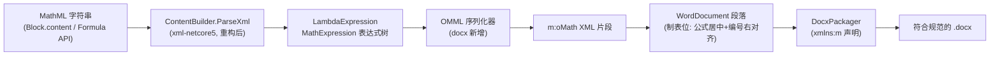

## Product Overview

为 WordDocument 文档生成模块添加原生数学公式（OMML）支持：基于 xml-netcore5 项目中现有的 MathML 解析代码，将 Content MathML 解析为表达式树后序列化为 Word 原生公式对象（`m:oMath`），实现论文中"公式另行起、编号右端对齐”的规范排版；同时适度重构优化 MathML 解析模块本身的已知缺陷。

## Core Features

### 一、MathML 解析模块重构优化（xml-netcore5 项目）

- **修复 n-ary 运算链缺陷**：当前 `parseInternal` 只取 apply 前 3 个子元素，`a+b+c` 会丢失后续项——改为将 n-ary 同类运算符链折叠为左结合表达式树
- **新增关系运算符**：支持 `eq/leq/geq/neq`（论文公式 `W₁ = U₁₁ − U₁₂U₂₁` 必需 `=`）
- **扩展函数表**：在现有 9 个标准函数基础上补充常用函数（如 cot/sec/csc/log10/sqrt 等）
- **清理失效代码**：`Math.vb`/`Apply.vb` 中基于 XmlSerializer 的旧模型存在元素顺序 bug 且与 DOM 解析路径重复，标记弃用或移除；补齐 XML 文档注释
- 保持 `LambdaExpression.FromMathML(xmlText)` 现有公开入口向后兼容

### 二、WordDocument 公式支持（docx 项目）

- **OMML 转换器**：`MathExpression` 表达式树 → OMML XML 的 visitor 序列化
- `SymbolExpression` → `m:r`（Cambria Math 字体）；符号文本含 `_`/`^` 约定 → `m:sSub`/`m:sSup`（下标/上标，如 `U_11` → U₁₁）
- `divide` → `m:f` 竖式分式；`power` → `m:sSup`；`plus/minus/times` → 内联 run
- `MathFunctionExpression` → `m:func`（fName + e）
- 关系符（eq 等）→ 内联关系符 run
- **Formula API**：`WordDocument.Formula(mathml As String, Optional equationNo As String = "")`——解析 MathML → inline `m:oMath` + 制表位段落（公式居中、编号"(2-1)"右端对齐），符合论文规范"另行起、编号右端对齐”
- **math block 分流**：`WriteBlock` 中 `math`/`equation` 类型 content 以 `<math` 开头时走 OMML 路径，否则保持现有 CodeBlock；新增 `mathml` 类型别名
- **命名空间**：`document.xml` 根元素补 `xmlns:m` 声明

### 三、测试验证

- test 演示中论文公式的 MathML 内容（含 eq 关系符与下标约定）经 Formula 输出真实 OMML 公式对象
- 编译、OOXML 模式校验、Word 实测公式渲染

## Boundaries

- Content MathML 之外的表示（矩阵、求和/积分上下限、根式、分段函数）不在本期范围，可在转换器中留扩展点
- Presentation MathML（`mfrac`/`msub` 等展示标记）解析不在本期范围

## Tech Stack

- VB.NET（net10.0），复用现有两个项目，无新增第三方依赖
- `Microsoft.VisualBasic.MIME.application.xml`（xml-netcore5.vbproj）：MathML 解析（ContentBuilder/LambdaExpression/MathExpression 树）
- `Microsoft.VisualBasic.MIME.Office.WordDocument`（WordDocument.vbproj，已引用 xml-netcore5）：OMML 序列化与文档组装
- 验证：test 项目 + 既有 ooxxml-validator 工具 + Word COM 实测

## Implementation Approach

### 总体链路



### 关键决策

1. **表达式树作为中间层**：不直接从 MathML XML 生成 OMML，而是复用 `ContentBuilder.ParseXml` 产出的 `MathExpression` 树——解析与序列化解耦（SoC），MathML 重构不影响 OMML 转换器
2. **转换器放 docx 模块内**（新建 `docx/OMML.vb`）：OMML 是 Word 专属输出格式，放 WordDocument 项目职责清晰；通过项目引用消费 MathML 模块的公开类型
3. **MathML 重构保持公开入口不变**：`LambdaExpression.FromMathML` 签名不变，仅修缺陷与扩展，避免破坏全工作区既有消费者（执行前先用 code-explorer 查证消费者清单）
4. **公式编号排版**：inline `m:oMath` 与 `w:r` 可共存于同一段落——用居中制表位放公式、右对齐制表位放编号，符合规范且避免 oMathPara 与编号混排的兼容性问题
5. **run 字体**：OMML run 内 `w:rPr` 固定 `Cambria Math`（Word 数学字体），`m:r` 内不再叠加主题样式，保证公式渲染一致性

### OMML 结构映射表

| 表达式树节点 | OMML | 说明 |
| --- | --- | --- |
| SymbolExpression(text) | `m:r` + `m:t` | 变量/数字 run |
| text 含 `_` | `m:sSub`（e/sub） | 下标约定：U_11 → U₁₁ |
| text 含 `^` | `m:sSup`（e/sup） | 上标约定 |
| plus/minus/times | 运算符 `m:r` 内联 | 左结合展开 |
| divide | `m:f`（num/den） | 竖式分式 |
| power | `m:sSup`（e/sup） | 幂 |
| eq/leq/geq/neq（新增） | 关系符 `m:r` 内联 | 论文公式必需 |
| MathFunctionExpression | `m:func`（fName/e） | 函数应用 |
| 一元 minus | 负号 run + 操作数 | parseInternal 已转为 0-x，转换器识别 cn"0" 减法可简化输出 |


### 性能与可靠性

- 转换为一次性树遍历（O(n)，n=表达式节点数），StringBuilder 拼接，无热路径问题
- XML 文本全部经 XEsc 转义；所有 pPr/rPr 子元素顺序遵循 CT_ 序列（沿用项目既有强约束与注释约定）
- 解析失败（非法 MathML）抛出带上下文的异常而非静默降级，便于上游定位

## Directory Structure

```
g:\pixelArtist\src\framework\mime\
├── application%xml\MathML\                  # xml-netcore5 项目（MathML 重构）
│   ├── contentBuilder.vb                    # [MODIFY] parseInternal 支持 n-ary 链折叠、eq/leq/geq/neq 关系符、扩展函数表；补 XML 注释
│   ├── Math.vb                              # [MODIFY] 移除/弃用带顺序 bug 的旧 XmlSerializer 模型，保留可用部分并补注释
│   ├── Apply.vb                             # [MODIFY] 同上（与 ContentBuilder 注释中声明的顺序 bug 一致处理）
│   └── Expression\BinaryExpression.vb       # [MODIFY] （如需）新增 RelationExpression 或以 operator 字符串扩展承载关系符
└── applicationvnd.openxmlformats-officedocument.wordprocessingml.document\docx\
    ├── OMML.vb                              # [NEW] MathExpression → OMML XML 序列化器（visitor）；符号上下标约定拆分；Formula 段落生成辅助
    ├── WordDocument.vb                      # [MODIFY] 新增 Formula(mathml, equationNo) API；WriteBlock math 分支分流（<math 开头→OMML，否则 CodeBlock）
    └── DocxPackager.vb                      # [MODIFY] BuildDocumentXml 根元素补 xmlns:m 声明
test\
└── Program.vb                               # [MODIFY] DemoThesisFormatting 第二章公式改为 MathML 演示（eq + 下标约定 + 编号）
```

## Implementation Notes

- 遵循项目既有 XML 拼接约定与 CT_ 子元素顺序约束（pPr 内：tabs 需在 spacing 之后、jc 之前，顺序为 shd → spacing → tabs → ind → jc，执行时对照 ECMA-376 核对）
- OMML `m:r` 结构：`<m:r><w:rPr><w:rFonts w:ascii="Cambria Math" w:hAnsi="Cambria Math"/></w:rPr><m:t>text</m:t></m:r>`，w:rPr 在 m:t 之前
- 制表位位置按页面内容宽度计算（与 Table 方法 `_pageWidth - _marginLeft - _marginRight` 一致）
- 重构 MathML 前必须先用 [subagent:code-explorer] 查证全工作区对 MathML 类型的消费者（尤其 mzkit/R# 生态可能引用），确保只做兼容性增强
- 验证：dotnet build/run test → ooxml-validator 模式校验 → Word COM 打开确认公式对象存在（InlineShapes/OMaths 计数）且编号右对齐

## Agent Extensions

### SubAgent

- **code-explorer**
- Purpose：在重构 MathML 模块前，查证全工作区对 MathML 命名空间类型（LambdaExpression/BinaryExpression/SymbolExpression/MathFunctionExpression/ContentBuilder/Math/Apply）的所有消费者，确认重构改动半径与兼容性约束；同时核对 ECMA-376 中 pPr/tabs 的合法子元素顺序
- Expected outcome：消费者清单与影响面报告，指导"只增强不破坏"的重构边界