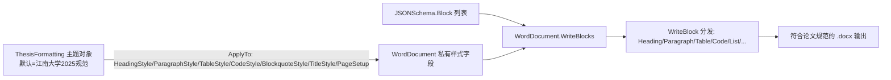

## Product Overview

为 VB.NET Word 文档生成模块新增“论文主题格式”能力：在 docx\ThesisFormatting.vb 中实现一个可自定义的主题样式对象，该对象承载《江南大学研究生学位论文要求及格式规范（2025年修订）》的全部版式规则，并应用到 WordDocument 的样式体系中，使 WordDocument.WriteBlocks（WordDocument.vb:948-958）写入的 JSONSchema.Block 文档内容自动获得论文规范样式。

## Core Features

- **主题样式对象 ThesisFormatting**：内置符合规范的默认样式，且所有样式属性公开可改（可自定义）
- 章标题（heading level 1）：三号黑体、居中、段前段后各空 1 行
- 节标题（level 2）：四号宋体加粗、左对齐、段前段后各空 0.5 行
- 小节标题（level 3）：小四宋体加粗、左对齐、段前段后各空 0.5 行
- level 4-6 标题：按规范精神给出合理降级样式
- 正文段落：小四宋体（西文 Times New Roman）、首行缩进 2 字符、1.25 倍行距
- 表格：表头/内容五号字、三线表风格；代码块与引用块：适配论文版式
- 页面：A4，上下左右页边距各 2.5cm
- **主题应用**：提供 ApplyTo(doc As WordDocument) 方法，通过 WordDocument 既有流式样式 API（HeadingStyle/ParagraphStyle/TableStyle/CodeStyle/BlockquoteStyle/TitleStyle/PageSetup）一次性应用全部主题样式
- **测试验证**：在 test\Program.vb 中新增论文格式演示用例（WriteBlocks + ThesisFormatting），运行调试并输出 docx 供人工核查

## Boundaries

- 页眉页脚（奇偶页页眉、罗马/阿拉伯页码分段）当前 WordDocument 无底层支持，本期不实现，仅预留说明
- 封面、原创性声明、目录生成等结构化页面不在本期范围；主题仅作用于 Block 流式内容渲染样式

## Tech Stack

- 语言/框架：VB.NET（复用现有 MIME Office WordDocument 模块，无新增第三方依赖）
- 核心类型：docx\WordStyle\WordStyle.vb 的 WordStyle（FontName/FontNameEastAsia/Size(磅)/Bold/Alignment/LineSpacing(倍数)/SpaceBefore/SpaceAfter(磅)/FirstLineIndent(磅)）与 TableStyle
- 目标 API：WordDocument 既有流式设置器 HeadingStyle(1-6)/ParagraphStyle/DefaultStyle/TableStyle/CodeStyle/BlockquoteStyle/TitleStyle/PageSetup

## Implementation Approach

- **策略**：ThesisFormatting 作为纯样式载体（Theme 对象），内部以公开可写属性（Heading1Style…Heading6Style、BodyStyle、CodeStyle、BlockquoteStyle、TableStyle、TitleStyle、页边距常量）持有样式，构造时按江南大学规范初始化默认值；对外提供 `ApplyTo(doc As WordDocument) As WordDocument`，内部逐项调用 WordDocument 既有流式 API 完成应用
- **关键决策**：

1. 不改动 WordDocument 内核（零侵入）：WriteBlock 已将 block.type 分发到 Heading/Paragraph/Table 等方法并消费 _headingStyles/_paragraphStyle 等私有字段，只需在 WriteBlocks 之前经 ApplyTo 替换这些字段即可生效，改动半径最小
2. 样式属性公开可写实现“可自定义”：使用者可改属性后调用 ApplyTo，或派生新主题类
3. 字号换算：三号=16pt、四号=14pt、小四=12pt、五号=10.5pt；首行缩进 2 字符=24pt（小四）；页边距 2.5cm≈1417 twips
4. 字体规范：FontNameEastAsia=宋体/黑体（中文字体），FontName=Times New Roman（西文/数字），符合“中文宋体、西文 Times New Roman”要求

- **性能与可靠性**：样式应用为一次性对象属性赋值，O(1)，无热路径；ApplyTo 对 null 文档参数做防御返回；样式对象通过 Clone 或新建实例避免共享引用被后续修改串扰

## Architecture Design



## Directory Structure

```
applicationvnd.openxmlformats-officedocument.wordprocessingml.document/
├── docx/
│   └── ThesisFormatting.vb   # [MODIFY] 实现论文主题类：公开样式属性（按江南大学规范初始化默认值）+ ApplyTo(doc) 方法；含三线表 TableStyle、页边距 2.5cm 页面设置；XML 文档注释齐全
└── test/
    └── Program.vb            # [MODIFY] 新增 DemoThesisFormatting 演示：构造论文样章 Block 列表（章/节/小节标题、正文、表格、代码、引用、列表），ApplyTo 后 WriteBlocks 输出 thesis_demo.docx
```

## Implementation Notes

- 遵循项目既有约定：样式均以 `New WordStyle With {...}` 对象初始化器构造；对齐方式用字符串 "left"/"center"；TableStyle 边框 BorderSize 以 1/8pt 为单位（三线表可用较粗上下框线）
- 主题类放在与 WordDocument.vb 同命名空间下（文件头不加 Region 版权头，保持与现有 ThesisFormatting.vb 壳一致），确保无需额外 Imports 即可被 test 项目使用
- 段前/段后“空1行”按当前字号磅值折算（如三号标题段前段后各 16pt，0.5 行按 8pt 折算），并在注释中说明折算规则便于自定义
- 运行调试：使用 PowerShell 在工作区执行 `dotnet run --project test/test.vbproj`（或 msbuild 编译 slnx 后运行 test 输出），检查 z:/my-project/WordDocument/output 下生成的 docx

## Agent Extensions

### SubAgent

- **code-explorer**
- Purpose：在实现前快速查证 WordDocument.vb 中 Heading/Paragraph/Table/Image(caption)/CodeBlock 等方法对 _headingStyles/_paragraphStyle/_tableStyle 等私有样式字段的具体消费方式（如题注是否走独立样式），确认 ApplyTo 覆盖面无遗漏
- Expected outcome：明确各 WriteBlock 分支实际生效的样式字段清单，确保 ThesisFormatting 的样式属性设计覆盖全部可见输出