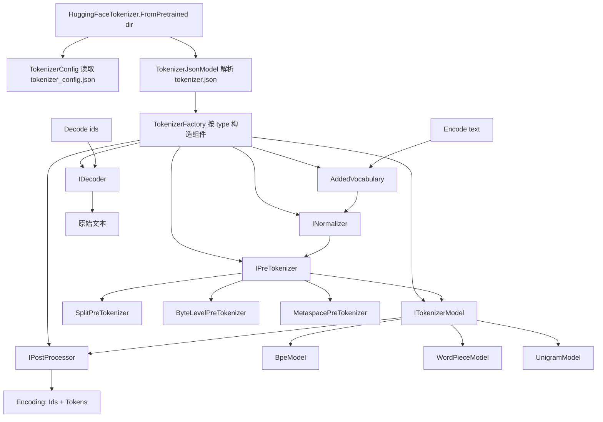

## 用户需求

更新 `NLP\Tokenizer\src` 分词算法模块，在现有中文分词（词典 + 最大匹配 + HMM）能力之外，新增对 Hugging Face `transformers` / `tokenizers` 体系的支持：能够直接加载 `hugging_face_tokenizer\tokenizer.json` 与 `hugging_face_tokenizer\tokenizer_config.json` 中的分词器模型数据，并输出与 `hugging_face_tokenizer\deepseek_tokenizer.py` 一致的分词结果。

## 产品概述

为 VB.NET 自然语言分词模块增加一套 Hugging Face 兼容的子词分词器（Subword Tokenizer）。用户只需指定模型目录，即可像 Python 端 `AutoTokenizer.from_pretrained(dir)` 一样得到一个可用的分词器实例，对任意文本执行 `Encode` 得到 token id 序列、token 字符串序列，并支持 `Decode` 还原文本。

## 核心功能

- **模型加载**：从目录一次性加载 `tokenizer.json`（词表、合并规则、归一化器、预分词器、后处理器、解码器、追加词）与 `tokenizer_config.json`（BOS/EOS/PAD/UNK、是否自动添加 BOS/EOS、最大长度），加载后可复用。
- **三类底层算法**：
- **BPE**（含 ByteLevel 字节映射、合并优先级、`byte_fallback`/`fuse_unk`/`continuing_subword_prefix`/`end_of_word_suffix` 等配置）
- **WordPiece**（`##` 续接前缀、贪心最长匹配、超长词降级为未知词）
- **Unigram / SentencePiece**（对数概率词表、Viterbi 最优切分、Metaspace `▁` 处理、字节回退）
- **完整分词流水线**：追加词优先切分 → 归一化 → 预分词（Split / ByteLevel / Metaspace / Whitespace / Punctuation / Digits 等序列组合）→ 模型切分 → 后处理（模板 / ByteLevel / BertProcessing）→ 输出 id 与 token。
- **编码与解码**：`Encode` 返回 token id 列表与 token 文本，可选择是否附加特殊 token；`Decode` 支持跳过特殊 token 并按解码器规则还原原始文本。
- **结果对齐验证**：在测试工程中对 `"Hello!"` 等样例执行编码，逐 id 打印并与 Python 端输出比对，同时输出 token 文本便于人工核对；覆盖英文、中文、数字、标点、空格、换行、特殊 token 等场景。
- **兼容性保障**：现有中文分词器的类型与调用方式完全不变，新能力以独立入口提供。

## 技术栈

- 语言 / 框架：VB.NET，`net10.0-windows;net10.0`（沿用 `NLP\NLP.NET.vbproj` 现有 `TargetFrameworks`）
- 工程：SDK 风格工程，`.vb` 文件自动包含，**新增文件无需修改 vbproj**
- 程序集 / 根命名空间：`Microsoft.VisualBasic.Data.NLP`
- JSON 解析：复用项目已有的 `Microsoft.VisualBasic.Serialization.JSON`（sciBASIC），与 `NLP\Text\Model\TokenCounter.vb` 中的用法保持一致
- 正则：`System.Text.RegularExpressions`（.NET 原生支持 `\p{L}` `\p{M}` `\p{N}` `\p{P}` `\p{S}` 与 `(?!\S)` 负向先行）
- 测试：`NLP\test\test.vbproj`（Exe，已引用 `NLP.NET.vbproj`）

## 实现策略

### 总体思路

严格复刻 Hugging Face `tokenizers` 的**五段式流水线**，用接口分层让同一套加载器同时支撑 BPE / WordPiece / Unigram：

```
输入文本
  → AddedVocabulary 切分（追加词/特殊词优先命中，不进模型）
  → Normalizer（Sequence / NFKC / NFD / Lowercase / StripAccents / Replace / Prepend / Precompiled）
  → PreTokenizer（Sequence / Split / ByteLevel / Metaspace / Whitespace / Punctuation / Digits）
  → Model（BPE | WordPiece | Unigram）逐分片切分
  → PostProcessor（ByteLevel / TemplateProcessing / BertProcessing / RobertaProcessing / Sequence）
  → Encoding（Ids + Tokens）
```

对应 DeepSeek 这份 `tokenizer.json` 的实测配置：`normalizer` 为空序列、`pre_tokenizer` 是 3 个 `Split(Isolated)` + `ByteLevel(add_prefix_space=false, use_regex=false)`、`model.type=BPE`（`unk_token=null`、`byte_fallback=false`、vocab 12.8 万、merges 12.7 万）、`post_processor`/`decoder` 均为 `ByteLevel`；叠加 `tokenizer_config.json` 的 `add_bos_token=false` / `add_eos_token=false`，因此 `encode("Hello!")` 的期望输出是**纯 BPE id 序列，不含任何 BOS/EOS**。

### 关键技术决策

1. **接口分层而非硬编码分支**：定义 `INormalizer` / `IPreTokenizer` / `ITokenizerModel` / `IPostProcessor` / `IDecoder` 五个接口，由 `TokenizerFactory` 依据 JSON 的 `type` 字段构造。这样三种模型共用一条流水线，后续新增 model 类型只需实现接口并在工厂注册，避免 `Select Case` 散落各处（开闭原则）。虽然用户未显式勾选"通用可插拔框架"，但同时要求三种模型，分层是成本最低且唯一可维护的做法。

2. **ByteLevel 字节映射必须精确复刻 GPT-2 `bytes_to_unicode`**：vocab 的 key 是字节映射后的可见字符串（`Ġ` 表示空格，非 ASCII 呈现为 `å±ĭ` 这类字符）。实现为两张静态查表：`Byte→Char`（256 项数组）与 `Char→Byte`（`Dictionary(Of Char, Byte)`），静态构造一次全局复用。编码时 UTF-8 bytes → 映射字符串再查 vocab；解码时反向映射回字节再 UTF-8 解码。这是能否对齐 Python 输出的**第一决定性因素**。

3. **Split(Isolated) 语义严格实现**：`Isolated` 表示匹配片段独立成片、未匹配片段同样保留成片（不丢弃、不合并）。Sequence 预分词器需对**上一级产出的每个分片**继续切分，而非对原串重复切分。实现上用 `List(Of String)` 逐级 map-flatten。

4. **正则模式从 JSON 动态读取，不硬编码**：第 3 个 Split 的模式串含真实换行字符与复杂转义，硬编码极易出错。直接取 JSON 中的 pattern 字符串编译为 `Regex`，并加 `RegexOptions.Compiled | RegexOptions.CultureInvariant`。同时预留 Rust `fancy-regex` 与 .NET 的少量差异说明（如 `\p{P}`/`\p{S}` 类别边界），若比对不一致优先排查此处。

5. **BPE 合并采用 rank 驱动 + 就地合并**：merges 实测是**旧版字符串格式** `"A B"`（非数组对），解析时以**第一个空格**切分（两侧 token 自身不含空格）。构建 `Dictionary(Of String, Integer)`：key 为 `"A B"`、value 为下标即 rank。切分单个分片时，将其拆为字符符号列表，反复扫描相邻 pair 取 rank 最小者合并，直至无可合并。单片长度 L 时复杂度约 O(L²)，因预分词后分片极短（通常 < 20），实际开销可忽略；并对**已切分过的分片结果做 LRU/字典缓存**，重复词直接命中，显著提升长文本吞吐。

6. **Unigram 用 Viterbi 求最优切分**：词表为 `[token, log_prob]` 数组，构建 Trie 加速前缀枚举，对长度 n 的输入做 O(n × maxTokenLen) 动态规划，回溯得到最大对数概率切分；未覆盖字符走 `byte_fallback` 或 `unk_id`。配套 Metaspace（空格替换为 `▁`、可选 `add_prefix_space`）与 `Precompiled` 归一化（无 precompiled_charsmap 时降级为 NFKC，并记录警告）。

7. **WordPiece 贪心最长匹配**：从左向右取词表中最长匹配子串，非首片加 `continuing_subword_prefix`（默认 `##`）；单词长度超过 `max_input_chars_per_word`（默认 100）或任意位置无匹配时，整词映射为 `unk_token`。

8. **AddedVocabulary 优先切分**：`added_tokens`（本模型含 BOS/EOS/PAD 及大量 `<｜place▁holder▁no▁N｜>`，id 可超出 vocab 范围如 128000+）需在归一化前用整串扫描命中，命中片段直接产出对应 id 且不进入模型。为避免 12.8 万级别字符串的 `IndexOf` 轮询，采用 **Trie（复用项目 `WordDictionary` 的 Trie 思路）或单条大正则 + 最左最长**匹配，保证 O(n) 扫描。

9. **加载性能与内存**：按用户选择使用 sciBASIC JSON 一次性解析 7.8MB 文件，解析后立即转为 `Dictionary(Of String, Integer)`（vocab）、`String()`（id→token 反查数组，按 id 索引直接定位）与 merges rank 字典，并**释放 JSON 中间对象引用**便于 GC 回收。`FromPretrained(dir)` 为唯一加载入口，实例线程安全只读、可全局复用；对 vocab/reverse-vocab 预分配容量（约 13 万）以减少扩容与 rehash。

### 避免技术债

- 完全不改动 `ChineseTokenizer.vb` / `MaxMatchTokenizer.vb` / `HmmModel.vb` / `WordDictionary.vb` 的现有公开 API，新代码落在独立子目录与独立命名空间，零回归风险。
- 沿用现有文件的编码风格：文件头 `#Region` 版权块、`Namespace` 包裹、XML 文档注释、`Imports std = System.Math` 别名习惯。
- 不新增任何第三方 NuGet 依赖，仅用 BCL + 已有 sciBASIC 引用。

## 实现要点

- **对齐优先级**：先保证 BPE + ByteLevel 链路与 Python 逐 id 一致，再补 WordPiece / Unigram；后两者以自造小型 tokenizer.json 或公开模型结构做结构性验证。
- **`Encode` 默认行为**：依据 `tokenizer_config.json` 的 `add_bos_token=false` / `add_eos_token=false`，默认**不添加**特殊 token，与 `deepseek_tokenizer.py` 的 `tokenizer.encode("Hello!")` 语义一致；同时提供 `addSpecialTokens` 参数供显式控制。
- **ByteLevel post_processor 的 `add_prefix_space=true`** 仅影响 offsets 与解码语义，因 pre_tokenizer 的 ByteLevel 已设 `add_prefix_space=false`，**编码阶段不得重复添加前导空格**，否则 id 会整体偏移——这是最易踩的坑，需重点核对。
- **测试入口冲突**：`NLP\test\Program.vb` 现有 `Module Program2` 且入口名为 `Main11111`（非标准 `Main`）。新增验证模块时提供标准 `Sub Main`，若出现"定义了多个入口点"或启动对象歧义，则在 `test.vbproj` 中显式设置 `<StartupObject>`，不修改既有 `Program2` 的逻辑。
- **Python 不可用的兜底**：用户环境为 Windows/PowerShell，未必装有 `transformers`。验证时先尝试运行 `deepseek_tokenizer.py` 取真值；若不可用，则改为输出 VB.NET 侧的 id + token 文本，用 ByteLevel 手工反解（如 `"Hello!"` → `Hello` / `!`）核对合理性，并在测试代码中以常量形式固化期望值便于后续回归。
- **错误处理**：文件缺失、`model.type` 不支持、`unk_token` 缺失但需要回退等场景抛出带明确信息的异常；对 `Precompiled` 归一化等降级处理路径打印一次性警告，避免日志刷屏。
- **日志**：仅在加载阶段输出词表规模、merges 条数、model 类型等摘要信息，编码热路径不打日志。

## 架构设计



## 目录结构

本次改动在 `NLP\Tokenizer\src` 下新增 `HuggingFace` 子目录承载全部新增代码，现有 4 个 .vb 文件保持不变；仅修改 `NLP\Tokenizer\README.md` 补充文档，并在 `NLP\test` 增加验证入口。

```
G:\pixelArtist\src\framework\nlp\
├── NLP\
│   ├── NLP.NET.vbproj                    # [不修改] SDK 风格工程自动包含新增 .vb 文件
│   ├── Tokenizer\
│   │   ├── README.md                     # [MODIFY] 新增"Hugging Face 分词器支持"章节：FromPretrained 用法、
│   │   │                                 #   支持的 model/normalizer/pre_tokenizer/decoder 类型矩阵、
│   │   │                                 #   Encode/Decode API 说明、与 deepseek_tokenizer.py 的对齐验证说明
│   │   └── src\
│   │       ├── ChineseTokenizer.vb       # [不修改]
│   │       ├── HmmModel.vb               # [不修改]
│   │       ├── MaxMatchTokenizer.vb      # [不修改]
│   │       ├── WordDictionary.vb         # [不修改]
│   │       └── HuggingFace\
│   │           ├── Abstractions.vb       # [NEW] 五大接口定义：INormalizer/IPreTokenizer/ITokenizerModel/
│   │           │                         #   IPostProcessor/IDecoder，以及 Token 结构（Id/Value/Start/End）、
│   │           │                         #   Encoding 结果类（Ids/Tokens/TypeIds/AttentionMask）。所有接口方法
│   │           │                         #   均为无副作用只读操作，保证实例线程安全共享。
│   │           ├── TokenizerJson.vb      # [NEW] tokenizer.json 的 DTO 与解析入口。用 sciBASIC
│   │           │                         #   Microsoft.VisualBasic.Serialization.JSON 解析后转为强类型结构：
│   │           │                         #   added_tokens 列表、normalizer/pre_tokenizer/post_processor/decoder
│   │           │                         #   原始节点、model 段（type/vocab/merges/unk_token/byte_fallback/
│   │           │                         #   fuse_unk/continuing_subword_prefix/end_of_word_suffix/dropout）。
│   │           │                         #   merges 需兼容"A B"字符串格式（按首个空格切分）与 ["A","B"] 数组格式。
│   │           │                         #   vocab 需同时产出 token→id 字典与 id→token 数组（按最大 id 预分配）。
│   │           ├── TokenizerConfig.vb    # [NEW] tokenizer_config.json 解析：add_bos_token/add_eos_token/
│   │           │                         #   bos_token/eos_token/pad_token/unk_token（支持 AddedToken 对象与
│   │           │                         #   纯字符串两种写法）/model_max_length/tokenizer_class/
│   │           │                         #   clean_up_tokenization_spaces。缺省值需与 HF 保持一致。
│   │           ├── ByteLevelAlphabet.vb  # [NEW] GPT-2 bytes_to_unicode 双向映射表。Shared ReadOnly 静态构造
│   │           │                         #   256 项 Byte→Char 数组与 Char→Byte 字典；提供 EncodeBytes(text)
│   │           │                         #   (UTF-8 → 映射字符串) 与 DecodeToBytes(token) (映射字符串 → 字节)。
│   │           │                         #   这是与 Python 输出对齐的核心，必须逐字节精确。
│   │           ├── Normalizers.vb        # [NEW] INormalizer 实现集：SequenceNormalizer、NFKC/NFD/NFC/NFKD
│   │           │                         #   (用 String.Normalize)、Lowercase、StripAccents、Strip、Replace、
│   │           │                         #   Prepend、Precompiled(无 charsmap 时降级 NFKC 并一次性告警)、
│   │           │                         #   NullNormalizer(空序列直通)。
│   │           ├── PreTokenizers.vb      # [NEW] IPreTokenizer 实现集：SequencePreTokenizer(对上级每个分片
│   │           │                         #   逐级切分并 flatten)、SplitPreTokenizer(支持 Isolated/Removed/
│   │           │                         #   MergedWithPrevious/MergedWithNext/Contiguous 五种 behavior 与
│   │           │                         #   invert，Regex 从 JSON 动态读取并 Compiled 缓存)、
│   │           │                         #   ByteLevelPreTokenizer(use_regex 控制是否套用 GPT-2 切分正则、
│   │           │                         #   add_prefix_space 控制前导空格，随后做字节映射)、
│   │           │                         #   MetaspacePreTokenizer(空格→▁ 及 prepend_scheme)、
│   │           │                         #   Whitespace/WhitespaceSplit/Punctuation/Digits。
│   │           ├── BpeModel.vb           # [NEW] ITokenizerModel 的 BPE 实现。持有 vocab 字典、id→token 数组、
│   │           │                         #   merges rank 字典("A B"→rank)。Tokenize 流程：分片拆为符号序列 →
│   │           │                         #   循环取 rank 最小相邻 pair 合并 → 查表映射 id。支持 unk_token、
│   │           │                         #   fuse_unk、byte_fallback(<0xXX> 形式)、continuing_subword_prefix、
│   │           │                         #   end_of_word_suffix、ignore_merges。内置分片级结果缓存（有界字典）
│   │           │                         #   避免重复计算，提升长文本吞吐。
│   │           ├── WordPieceModel.vb     # [NEW] ITokenizerModel 的 WordPiece 实现。贪心最长匹配：从左向右在
│   │           │                         #   vocab 中找最长匹配子串，非首片加 continuing_subword_prefix(默认 ##)；
│   │           │                         #   词长超过 max_input_chars_per_word(默认 100) 或中途无匹配则整词
│   │           │                         #   输出 unk_token。
│   │           ├── UnigramModel.vb       # [NEW] ITokenizerModel 的 Unigram/SentencePiece 实现。词表为
│   │           │                         #   [token, log_prob] 数组；构建 Trie 加速前缀枚举，Viterbi 动态规划
│   │           │                         #   求最大对数概率切分并回溯；未覆盖字符走 byte_fallback 或 unk_id。
│   │           ├── PostProcessors.vb     # [NEW] IPostProcessor 实现集：ByteLevelPostProcessor(不增删 token，
│   │           │                         #   仅处理 offsets 语义，务必不重复添加前导空格)、TemplateProcessing
│   │           │                         #   (single/pair 模板与 special_tokens 展开)、BertProcessing、
│   │           │                         #   RobertaProcessing、SequencePostProcessor、NullPostProcessor。
│   │           ├── Decoders.vb           # [NEW] IDecoder 实现集：ByteLevelDecoder(映射字符还原字节后 UTF-8
│   │           │                         #   解码)、WordPieceDecoder(去 ## 并按空格拼接)、MetaspaceDecoder
│   │           │                         #   (▁ 还原为空格)、Replace/Strip/Fuse/ByteFallback、SequenceDecoder。
│   │           ├── TokenizerFactory.vb   # [NEW] 组件工厂。依据 JSON 节点的 type 字段分发构造 Normalizer/
│   │           │                         #   PreTokenizer/Model/PostProcessor/Decoder；遇到不支持的 type 抛出
│   │           │                         #   含具体 type 名的明确异常，便于快速定位缺失能力。
│   │           ├── AddedVocabulary.vb    # [NEW] added_tokens 优先切分。用 Trie(参考 WordDictionary 的 Trie
│   │           │                         #   思路)或单条大正则做最左最长匹配，支持 special/normalized/
│   │           │                         #   lstrip/rstrip/single_word 语义；命中片段直接产出 id(可超出 vocab
│   │           │                         #   范围，如 128000+)且不进入模型。O(n) 扫描，避免逐词 IndexOf。
│   │           └── HuggingFaceTokenizer.vb # [NEW] 对外主入口，对标 Python AutoTokenizer。
│   │                                     #   Shared FromPretrained(dir) / FromFile(tokenizerJson, configJson)；
│   │                                     #   Encode(text, addSpecialTokens) As Encoding、EncodeToIds、
│   │                                     #   Tokenize(text) As String()、Decode(ids, skipSpecialTokens)、
│   │                                     #   TokenToId/IdToToken、VocabSize、BosToken/EosToken/PadToken 属性。
│   │                                     #   默认 addSpecialTokens 依据 config 的 add_bos_token/add_eos_token
│   │                                     #   (本模型均为 false)，确保与 deepseek_tokenizer.py 语义一致。
│   └── test\
│       ├── test.vbproj                   # [MODIFY-可选] 仅当出现多入口点冲突时，显式添加 <StartupObject>
│       │                                 #   指向新的验证模块，不改动其它配置
│       └── HFTokenizerTest.vb            # [NEW] 可运行验证入口。加载 hugging_face_tokenizer 目录，
│                                         #   对 "Hello!" 执行 Encode，打印 id 列表与 token 文本；
│                                         #   覆盖英文/中文/数字/标点/空格/换行/特殊 token 等用例；
│                                         #   打印 Decode 回环结果验证可逆性；将期望 id 以常量固化便于回归。
└── hugging_face_tokenizer\               # [不修改] 模型数据源（tokenizer.json 7.8MB / tokenizer_config.json）
```

## 关键代码结构

仅给出跨模块依赖、必须精确约定的核心接口契约：

```
Namespace ChineseTokenizer.HuggingFace

    ''' <summary>单个 token 的切分结果。</summary>
    Public Structure Token
        Public Id As Integer
        Public Value As String
        Public Start As Integer
        Public [End] As Integer
    End Structure

    ''' <summary>分词模型统一契约：BPE / WordPiece / Unigram 均实现该接口。</summary>
    Public Interface ITokenizerModel
        ''' <summary>对一个预分词分片执行子词切分。</summary>
        Function Tokenize(fragment As String) As IEnumerable(Of Token)
        Function TokenToId(token As String) As Integer?
        Function IdToToken(id As Integer) As String
        ReadOnly Property VocabSize As Integer
    End Interface

    ''' <summary>预分词器契约：对上一级产出的分片继续切分。</summary>
    Public Interface IPreTokenizer
        Function PreTokenize(fragments As List(Of String)) As List(Of String)
    End Interface

End Namespace
```

## Agent Extensions

### SubAgent

- **code-explorer**
- Purpose: 在实现前定位 sciBASIC `Microsoft.VisualBasic.Serialization.JSON` 的确切 API（`LoadJSON`/`ParseJson`/`JsonObject` 索引方式）与项目内既有调用样例，避免解析层写法与框架不符导致编译失败
- Expected outcome: 明确 JSON 解析的可用方法签名与取值写法，`TokenizerJson.vb` / `TokenizerConfig.vb` 一次编译通过

### Skill

- **lsp-code-analysis**
- Purpose: 在新增 `HuggingFace` 子目录代码后，检查接口实现完整性、符号引用与命名冲突（尤其 `Tokenizer` 类名与现有 `ChineseTokenizer.Tokenizer` 的歧义），并在测试工程中确认入口点唯一性
- Expected outcome: 无未实现接口成员、无命名冲突与未解析符号，测试工程启动对象明确