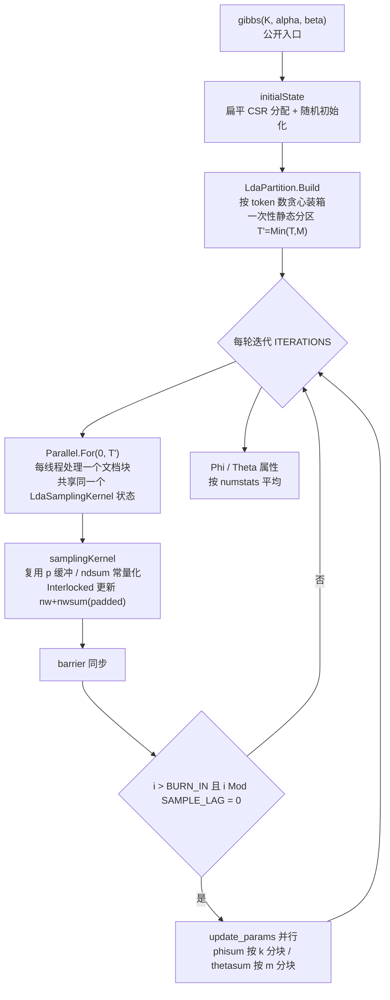
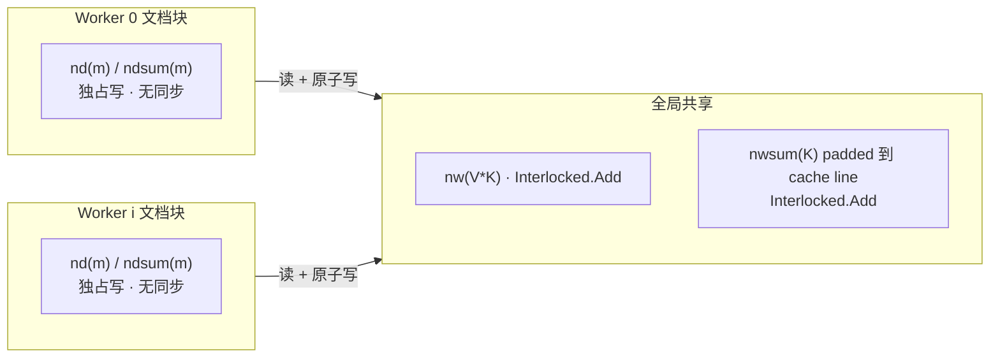

## 产品概述

对 `NLP/LDA` 中已有的 Gibbs 采样 LDA 主题模型做并行化重构。当前实现虽然已接入并行框架，但实测加速效果不理想、且并行分支存在数值污染。本项目的目标是把并行结构改为正确的文档分区模型，消除并行分支中退化的内存拷贝与计数竞争，在不改变对外调用方式的前提下显著提升训练速度，并给出可复现的性能与主题质量验证。

## 核心特性

- **真正的并行加速**：按语料规模一次性划分文档块，整个训练过程复用该划分，避免每篇文档反复启动并行调度带来的巨额开销。
- **结果可信**：并行分支不再出现计数被错误钳位、文档分母错乱的问题，主题质量与串行训练保持一致。
- **多规模通用**：无论"文档多且短""文档少且长"还是"大词表"语料，都能获得稳定收益，不会出现规模越大数据越慢的退化。
- **可复现验证**：提供基准测试程序，输出串行与并行的耗时、加速比，以及两种模式下主题词分布的重合度指标，用于确认并行没有把模型训坏。
- **调用方式不变**：主题数、先验参数、迭代次数、主题—词矩阵与文档—主题矩阵的读取接口保持原有形态，已有代码无需改动。

## 技术栈

沿用项目现有技术栈，不引入新依赖：

- VB.NET，`net10.0`（已验证本机 SDK `10.0.401`），项目 `g:/pixelArtist/src/framework/nlp/NLP/NLP.NET.vbproj`
- 并行原语：`System.Threading.Tasks.Parallel.For`、`System.Threading.Interlocked`（框架自带）
- 并行度来源继续沿用 `Microsoft.VisualBasic.Parallel.VectorTask.n_threads`（保证 `n_threads = 1` 表示串行这一既有语义不失效）
- 进度与日志继续沿用 `Tqdm.Range` / `bar.SetLabel` / `ApplicationServices.PerformanceCounter`

## 现状问题定位（已验证，实施时无需重新分析）

| 编号 | 问题 | 位置 | 影响 |
| --- | --- | --- | --- |
| P1 | 并行调度粒度错误：每篇文档 `New GibbsSamplingTask` + 一次 `Parallel.For` | `LdaGibbsSampler.vb:341-350`、`VectorTask.Run()` | 调度次数 O(ITERATIONS×M)，单文档工作量极小，开销远超收益（首要原因） |
| P2 | 并行分支每 token 拷贝长度 M 的 `ndsum`，且每任务重分配长度 M 的 `ndsumcopy` | `Gibbs.vb:110-148` | 复杂度退化为 O(iter×tokens×M)（第二原因） |
| P3 | `nw`/`nwsum` 全局共享，多线程 `+=` 无保护 | `Gibbs.vb:128-160` | 计数丢失 |
| P4 | 用 `If nw(topic) < 1 Then nw(topic) = 1` 等钳位掩盖负值 | `Gibbs.vb:139-142` | 系统性扭曲计数，phi/theta 质量下降 |
| P5 | 文档 token 被切给多线程后 `nd(zi)`/`ndsum(zi)` 也变共享写 | `Gibbs.vb:129-131` | 文档分母错误 |
| P6 | 每 token 分配 `Double(K)`；锯齿数组双重解引用 | `Gibbs.vb:182`、`124` | GC 压力 + cache miss |
| P7 | `ThreadLocal(Of Random)(New Random(Now.Millisecond * Now.Second + 1))` | `RandomExtensions.vb:208` | 多线程种子高度相关，且不可复现 |


## 实施方案

### 策略总览

采用**文档级静态分区 + 全局主题计数无锁批量更新**的近似并行（PLDA / LightLDA / MALLET 的通用做法）：把文档集一次性划分给各工作线程，每轮迭代只做一次 `Parallel.For`；文档独占的 `nd`/`ndsum` 完全无同步，全局共享的 `nw`/`nwsum` 用原子操作更新。

### 关键决策与权衡

**决策 1：分区在训练开始前计算一次，多轮复用**
调度次数从 `O(ITERATIONS × M)` 降到 `O(ITERATIONS × T)`（T 为线程数，通常 8~16）。这是解决 P1 的根本手段，也是本次重构收益最大的一项。

**决策 2：按 token 数贪心装箱，且文档不跨块**

- 按文档数均分会导致长文档块成为 straggler；按累计 token 数装箱可使各块工作量均衡，同时保持块内文档连续（`nd` 行的局部性更好）。
- 文档不跨块 ⇒ 一个文档的 `nd(m)`/`ndsum(m)` 只被一个线程写 ⇒ **零同步**解决 P5。
- 权衡：当文档数 M < 线程数 T 时并行度降为 M（剩余核空闲）。这是刻意取舍——允许文档跨块虽能提高并行度，却要引入 `nd`/`ndsum` 的原子同步，反而得不偿失。块数取 `T' = Min(T, M)`。

**决策 3：`nw` 与 `nwsum` 使用 padded 布局 + `Interlocked`**

- `nwsum` 仅 K 个元素（K=50 时约 200 字节 = 3 条 cache line），是最大的 false sharing 热点。改为每个 k 独占一条 cache line（步长 16 个 Int32）。
- `nw` 为 V×K，V 通常上万，不同线程命中同一 `(w,k)` 的概率低，直接 `Interlocked.Add` 即可。
- 每 token 原子操作数为 2（`nw` 一次、`nwsum` 一次），无锁、无拷贝、无 false sharing，同时**彻底移除 P4 的钳位逻辑**（负值不再出现，因为计数始终真实）。
- 备选（仅在 benchmark 显示计数同步成为瓶颈时启用）：每线程本地增量缓冲，按文档边界批量 flush。列为可选增强，默认不开启，避免过度设计。

**决策 4：`ndsum(m)` 在文档内是常量，直接消除**
每个 token 先 `-1` 再 `+1`，文档内 `ndsum(m) ≡ docLen(m)`。原代码每个 token 两次数组写纯属冗余，且是并行下的竞争源之一。改为直接使用 `docLen(m)`，`ndsum` 仅保留为 `Theta` 服务的常量视图。

**决策 5：内存布局扁平化为 CSR**
`documents()()` → `docs() + docOff() + docLen()`；`z()()` → `z()`；`nw()()` → `nw(V*K)`，索引 `w*K+k`；`nd()()` → `nd(M*K)`，索引 `m*K+k`。
收益：消除 V+1 / M+1 个对象分配与双重指针解引用，提升 cache 命中；内存从"锯齿数组"变为连续块。代价：`V*K` 需一次性连续内存（V=50k、K=50 时约 10 MB），可接受。

**决策 6：采样热循环重写**

- 每线程复用一个 `Double(K)` 缓冲（消除 P6 的每 token 分配）。
- 预计算 `Vbeta = V*beta`、`Kalpha = K*alpha`。
- 从三趟循环（算 p → 累加 → 线性查找）合并为两趟：算 `p(k)` 时同步累加 `total`；随后 `u = rand*total`，单趟做减法定位 topic。
- 每 worker 持有独立 xorshift RNG，种子 `seed ^ (workerId * 2654435761)`，消除线程间随机流相关性并支持可复现基准（解决 P7）。

**决策 7：`update_params` / `Phi` / `Theta` 一并并行化**
`phisum(k)(w)` 按 k 分块、`thetasum(m)(k)` 按 m 分块，写互不重叠，可直接 `Parallel.For`。注意这三处都在迭代末尾的串行点调用，不存在与采样的数据竞争。

### 复杂度分析

- 原并行分支：`O(ITERATIONS × N_tokens × M)`（P2 主导）＋ `O(ITERATIONS × M)` 次并行调度（P1 主导）。
- 优化后：`O(ITERATIONS × N_tokens × K)`（算法固有）＋ `O(ITERATIONS × T)` 次调度。
- 瓶颈从"调度开销 + 内存拷贝"回归到算法固有的 `N_tokens × K` 乘加与 `nw` 的随机读（内存带宽）。预期多短文档场景收益最大（P1/P2 完全消除），大词表场景受内存带宽限制、加速比会低于线性。

## 实施注意事项（防回归）

- **公开 API 必须保持**：`K`、`Phi`、`Theta`、`gibbs(K)`、`gibbs(K, alpha, beta)`、`configure(iterations, burnIn, thinInterval, sampleLag)`；Shared 字段 `ITERATIONS` 被 `Debugger.vb:102` 读取，不可改名或删除。
- **`VectorTask.n_threads` 语义保持**：`=1` 时走串行路径，使 `test/Program.vb` 的 `test1`/`test2` 对比语义不变。
- **进度条线程安全**：`bar.SetLabel` 只能在迭代末尾的串行代码段调用，不得移入 `Parallel.For` 体内。
- **`Gibbs.vb` 中的 `GibbsSamplingTask` 删除**：全仓检索确认无外部消费方（仅 `LdaGibbsSampler.vb` 引用），可安全移除。
- **不动 `Debugger.vb`**：其 `inference` 自带局部计数、不依赖 sampler 的 Friend 字段。（附带发现的既有 bug `For N As Integer = 0 To N - 1`，本次范围外，仅记录。）
- **零除与边界**：空文档（`docLen = 0`）需在分区与采样中跳过；`K=1` 时采样分布退化为单点。

## 架构设计



线程所有权划分（近似并行的正确性基础）：



## 目录结构

```
g:/pixelArtist/src/framework/nlp/NLP/
├── LDA/
│   ├── LdaGibbsSampler.vb            # [MODIFY] 主体改造：锯齿数组 -> 扁平 CSR 存储（docs/docOff/docLen/z/nw/nd/nwsum）；
│   │                                 #          initialState 重写；gibbs() 驱动循环改为"一次性分区 + 每轮一次 Parallel.For"；
│   │                                 #          update_params / Phi / Theta 并行化；保留全部公开 API 与 Shared ITERATIONS；
│   │                                 #          新增 Optional seed 参数用于可复现基准
│   ├── Gibbs.vb                      # [REPLACE] 删除 GibbsSamplingTask（P1~P5 的载体），
│   │                                 #          改为扁平 CSR 上的采样内核模块：预先计算的 Vbeta/Kalpha、
│   │                                 #          复用的 p 缓冲、ndsum 常量化、两趟扫描采样、Interlocked 计数更新
│   ├── LdaPartition.vb               # [NEW] 文档分区器：按累计 token 数贪心装箱，产出 Min(T,M) 个连续不相交文档块，
│   │                                 #          处理空文档与 M<T 的退化情况
│   └── LdaRng.vb                     # [NEW] 每 worker 独立的 xorshift64* 随机数发生器，
│   │                                 #          种子按 workerId 分散，替代种子高度相关的 ThreadLocal(Of Random)
└── test/
    ├── LdaBenchmark.vb               # [NEW] 基准测试与一致性校验：内置合成语料生成器（不依赖不存在的磁盘路径）、
    │                                 #          串行 vs 并行耗时与加速比、Top-N 主题词集合的 Jaccard 重合度与平均排名偏移
    └── Module1.vb                    # [MODIFY] Main 增加参数分流，按命令行参数触发 LDA benchmark（不新增 Main 入口，
                                      #          保持 StartupObject=test.Module1 不变）
```

## 关键代码结构

扁平 CSR 存储与分区契约（供 `LdaGibbsSampler` 与采样内核共同遵守）：

```
' LDA/LdaGibbsSampler.vb —— 替代原锯齿数组的内部存储
Friend docs As Integer()      ' 全部文档的 term id 拼接，长度 = 总 token 数
Friend docOff As Integer()    ' 文档 m 在 docs 中的起始偏移，长度 M
Friend docLen As Integer()    ' 文档 m 的 token 数（等价于 ndsum），长度 M
Friend zFlat As Integer()     ' 每个 token 的主题分配，与 docs 等长
Friend nw As Integer()        ' 长度 V*K，索引 w*K + k
Friend nd As Integer()        ' 长度 M*K，索引 m*K + k
Friend nwsumP As Integer()    ' 长度 K*CACHE_LINE_INTS，索引 k*CACHE_LINE_INTS，独占 cache line
```

分区与采样内核签名：

```
' LDA/LdaPartition.vb
Friend Structure DocBlock
    Friend docStart As Integer   ' 文档索引闭区间起点
    Friend docEnd As Integer     ' 文档索引闭区间终点
    Friend tokens As Integer     ' 该块 token 总数，用于负载评估
End Structure

Friend Function Build(docLen As Integer(), blocks As Integer, Optional minTokensPerBlock As Integer = 1) As DocBlock()

' LDA/Gibbs.vb —— 采样内核，由 Parallel.For 的每线程调用一次
Friend Sub SampleBlock(block As DocBlock, workerId As Integer,
                       ByRef st As SamplingState, ByRef rng As LdaRng)
```

采样状态聚合（避免每线程重复传参、复用 p 缓冲）：

```
' LDA/Gibbs.vb
Friend NotInheritable Class SamplingState
    Friend K As Integer
    Friend Vbeta As Double          ' V * beta，预计算
    Friend Kalpha As Double         ' K * alpha，预计算
    Friend nw As Integer()          ' 共享，Interlocked 写
    Friend nwsumP As Integer()      ' 共享 padded，Interlocked 写
    Friend nd As Integer()          ' 块内文档独占写
    Friend pBuf As Double()         ' 每线程一份，长度 K，复用
End Class
```

## Agent Extensions

### SubAgent

- **code-explorer**
- Purpose：在实施驱动循环重写前，精确核实 `Tqdm.Range` / `Tqdm.ProgressBar` 的签名与 `App.EnableTqdm` 定义，以及全仓是否还有 `GibbsSamplingTask`、`z`、`nw`、`nd`、`ndsum` 等 Friend 成员的其它引用点，避免删除/改名造成编译断裂
- Expected outcome：得到一份确认的 API 签名与引用点清单，确保重构后 `dotnet build` 一次通过、无遗漏调用方