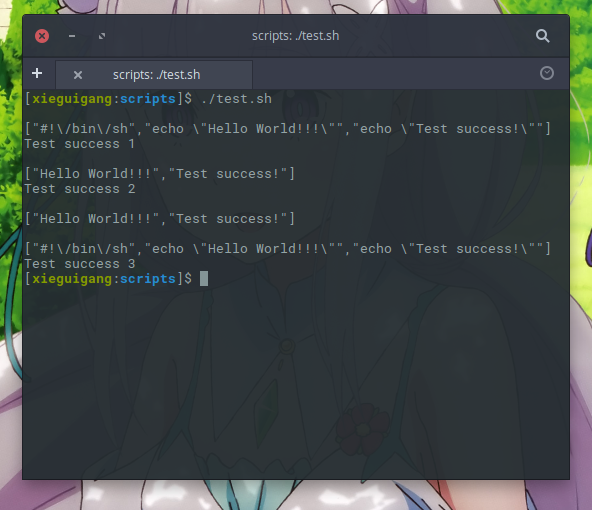

# VisualBasic CLI Pipeline

CLI pipeline is the most important language programming feature of the data analysis industry/or server technique as it providing the basically of the analysis workflow automation and language hybrids feature. Almost all of the Linux server tools supports this pipeline feature as nearly all of the management automation on the Linux server is based on the bash scripting.

Here is the pipeline API that provided in VisualBasic language server runtime: ``Microsoft.VisualBasic.CommandLine.CommandLine``, and it makes this CLI pipeline more simple.

|API|Description|
|---|-----------|
|``CommandLine.OpenStreamInput(String, String) As System.IO.StreamReader``|Open file input or ``std_in`` device as input|
|``CommandLine.OpenStreamOutput(String) As System.IO.StreamWriter``|Open file output or ``std_out`` device as output|

## Usage Example

### CLI

```vbnet
Imports System.IO
Imports Microsoft.VisualBasic.CommandLine
Imports Microsoft.VisualBasic.CommandLine.Reflection
Imports Microsoft.VisualBasic.Serialization.JSON

Module Program

    Public Function Main() As Integer
        Return GetType(Program).RunCLI(App.CommandLine)
    End Function

End Module
```

### input bash

```bash
#!/bin/sh
echo "Hello World!!!"
echo "Test success!"
```

### 1. Only file supports

```vbnet
<ExportAPI("/file", Usage:="/file /in <file.txt> [/out <out.txt>]")>
Public Function OnlySupportsFile(args As CommandLine) As Integer
    Dim [in] As String = args("/in")
    Dim out As String = args.GetValue("/out", [in].TrimSuffix & ".output.json")
    Return [in].ReadAllLines.GetJson.SaveTo(out).CLICode
End Function
```

Test bash script

```bash
# file inputs
# read file input as text file and output the processed content as json
./bin/PipelineTest.exe /file /in ./input.sh /out ./1.txt
```

Test output

```json
["#!\/bin\/sh","echo \"Hello World!!!\"","echo \"Test success!\""]
```

### 2. Only std_in/std_out(Pipeline) supports

```vbnet
<ExportAPI("/std", Usage:="/std <input> <output>")>
Public Function JustStdDevice() As Integer
    Using input = Console.OpenStandardInput, output = New StreamWriter(Console.OpenStandardOutput)
        Call output.Write(New StreamReader(input).ReadToEnd.lTokens.GetJson)
    End Using

    Return 0
End Function
```

Test bash script

```bash
# std inputs
./input.sh | ./bin/PipelineTest.exe /std > ./2.txt
```

Test output

```json
["Hello World!!!","Test success!"]
```

### 3. Support both(file/Pipeline)

```vbnet
<ExportAPI("/pipe.Test", Usage:="/pipe.Test /in <file.txt/std_in> [/out <out.txt/std_out>]")>
Public Function SupportsBothFileAndPipeline(args As CommandLine) As Integer
    Using out = args.OpenStreamOutput("/out")
        Dim inData As String() = args.OpenStreamInput("/in").ReadToEnd.lTokens
        Call out.Write(inData.GetJson)
    End Using

    Return 0
End Function
```

Test bash script

```bash
# both supports
# just using standard input/output
./input.sh | ./bin/PipelineTest.exe /pipe.Test > ./3.txt
# using file io
./bin/PipelineTest.exe /pipe.Test /in ./input.sh /out ./4.txt
```

Test output: 3.txt

```json
["Hello World!!!","Test success!"]
```

Test output: 4.txt

```json
["#!\/bin\/sh","echo \"Hello World!!!\"","echo \"Test success!\""]
```

This CLI pipeline visualbasic language programming feature was test successfully on both Windows10 and Ubuntu.



