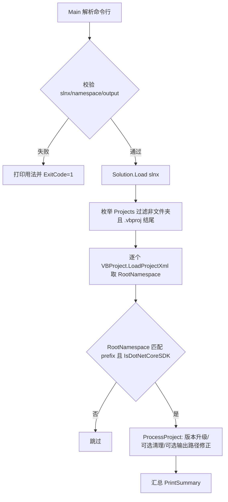

## 用户需求

优化 `PkgVersionUpgrade` 批量升级小工具，将其输入来源从"递归扫描目录"改为"解析 slnx 解决方案文件 + 命名空间前缀过滤"。

## 产品概述

这个小工具原本是递归扫描框架目录下所有 `*.vbproj` 并做版本号升级/配置清理/输出路径修正。现改为：启动时必须通过命令行参数指定一个 Visual Studio `slnx` 解决方案文件路径与一个命名空间前缀；工具解析该解决方案、枚举其中列出的 `vbproj`，再按命名空间前缀过滤，只对过滤后的目标 `vbproj` 执行更新操作。

## 核心功能

- 必填命令行参数：`--slnx <path>`（slnx 解决方案文件路径）与 `--namespace <prefix>`（命名空间前缀）。
- 解析 slnx 并枚举其声明的全部 `vbproj`（自动跳过解决方案文件夹与嵌套 Folder）。
- 按命名空间前缀（大小写不敏感 `StartsWith`）过滤 `vbproj`，仅对命中的目标工程做版本号升级、（可选）过时配置清理、（可选）输出路径修正。
- 新增 `--output <dir>` 参数：仅当 `--fix-output-path` 模式开启时必填，用于将目标 `vbproj` 的 `nuget_release|x64` 编译输出路径设置为"该输出文件夹相对于各 `vbproj` 的相对路径"（自动补建缺失配置组并补齐 `Configurations`/`Platforms` 声明）。
- 参数校验：缺少 `--slnx`/文件不存在、`--namespace` 为空、`--fix-output-path` 但未给 `--output` 时，报错并打印用法后退出。

## 技术栈

- 语言：Visual Basic (.NET 10，VB SDK 风格工程)
- 解析依赖：复用被引用工程 `dev/VisualStudio/VisualStudio.NET5.vbproj` 中已存在的 `Microsoft.VisualBasic.ApplicationServices.Development.VisualStudio.sln.Solution.Load` 与 `Project` 模型（支持 `.slnx` 解析并解析 `FullPath`）
- XML 处理：`System.Xml.Linq`（沿用现有 `PreserveWhitespace` 原地修改 + `XmlEditor` 工具，保证 diff 仅落在改动行）
- 命令行：沿用 `Microsoft.VisualBasic.CommandLine` 的 `Opt` 属性 + `CreateOpts(Of CliOptions)`

## 实现方案

### 总体策略

将 `Main` 的输入来源从"框架根目录递归扫描"替换为"解析 slnx 枚举 + 命名空间前缀过滤"：先 `Solution.Load(slnx)` 得到 `Projects`，过滤出非文件夹且以 `.vbproj` 结尾的工程，逐个 `VBProject.LoadProjectXml` 取其 `RootNamespace` 并按前缀 `StartsWith` 二次过滤；过滤后的集合即"目标工程"，统一走既有 `VersionUpgrader`/`ConfigCleaner`/`OutputPathFixer` 逻辑。`--fix-output-path` 的目标目录由原先硬编码的框架根 `.nuget` 改为用户传入的 `--output` 文件夹，相对路径计算沿用 `OutputPathFixer.ComputeOutputPath`（已是工程目录→目标目录的通用相对路径函数）。

### 关键技术决策

1. **复用 `Solution.Load` 而非自行解析 slnx**：该 API 已正确处理 `<Folder>` 嵌套、相对路径解析为 `FullPath`、文件夹识别（`IsFolder`）。自行用 `XDocument` 解析需重写递归与路径解析，违背 DRY 且易与现有解析器行为不一致。
2. **命名空间过滤放在枚举后、处理前**：slnx 不携带 `RootNamespace`，必须先加载 `vbproj` 模型才能取该属性；非 SDK 工程仍由 `ProcessProject` 内的 `IsDotNetCoreSDK` 跳过，保持既有行为。
3. **`OutputPathFixer.Apply` 入参 `nugetDir` 改为通用 `outputDir`**：`ComputeOutputPath(projectPath, outputDir)` 本身即通用实现，仅需把参数语义从".nuget 目录"泛化为"用户输出目录"，无需改动相对路径算法。原有 `RootNamespacePrefix` 常量与 `IsTarget` 函数在本流程中不再被调用（过滤已上移），移除以避免死代码（确认 `ProcessProject` 是唯一调用方）。
4. **移除 `--root` 与 `FindFrameworkRoot`/`ScanProjects`/`CollectProjects`**：新流程不再需要框架根目录；显示用相对路径基准改为 slnx 文件所在目录。

### 性能与可靠性

- slnx 中 `vbproj` 数量远小于整棵目录树，加载/过滤/处理的复杂度仍为 O(N)（N 为工程数），无性能回归；`XDocument` 加载与 `VBProject.LoadProjectXml` 为既有热点，沿用不变。
- 校验失败（缺参/文件不存在/缺 `--output`）走现有 `opts.Error` + `PrintUsage` + `Environment.ExitCode=1` 路径，避免空跑或误改。
- 写回沿用 `SaveDocument`（`HasUtf8Bom` 保留 BOM、`Indent=False`、保留 XML 声明判定），保证 diff 最小、不破坏既有格式。

## 实现要点（执行细节）

- `CliOptions`：移除 `Root`；新增 `Slnx`（`-s/--slnx`）、`NamespacePrefix`（`-p/--prefix`、`--namespace`）、`OutputDir`（`-o/--output`）。必填性校验放在 `ParseCommandLine` 之后或 `Main` 中：写入 `CliOptions.Error`。
- `Program.Main`：删除 `FindFrameworkRoot`/`ScanProjects`/`CollectProjects`/`ExcludedDirectories`；改为 `Dim solution = Solution.Load(opts.Slnx)`，取 `projects = solution.Projects.Where(Function(p) Not p.IsFolder AndAlso p.FullPath.EndsWith(".vbproj", StringComparison.OrdinalIgnoreCase))`，遍历时加载模型并按 `RootNamespace.StartsWith(opts.NamespacePrefix, OrdinalIgnoreCase)` 过滤，命中才 `ProcessProject`。banner 与 `RelativePath` 显示基准改为 `Path.GetDirectoryName(opts.Slnx)`。
- `ProcessProject`：签名去掉 `root`/`nugetDir`，改为 `ProcessProject(path, outputDir, opts, timestamp)`；`opts.FixOutputPath` 时调用 `OutputPathFixer.Apply(doc, ns, path, outputDir)`（`outputDir` 为 `Path.GetFullPath(opts.OutputDir)`，否则传 `Nothing`）。
- `OutputPathFixer`：仅改 `Apply` 入参名 `nugetDir`→`outputDir`，内部 `ComputeOutputPath(projectPath, outputDir)`；删除 `RootNamespacePrefix` 常量与 `IsTarget` 函数。
- `PrintUsage`：更新参数说明与示例（`--slnx`、`--namespace`、`--output`，`--fix-output-path` 需配合 `--output`）。
- 日志/错误信息沿用 `Console.WriteLine` + `[error]`/`[warn]` 前缀，不输出完整异常堆栈（保持既有风格）。

## 架构设计

新数据处理流（替换原"目录递归扫描"分支）：



## 目录结构

```
PkgVersionUpgrade/
├── CliOptions.vb                  # [MODIFY] CliOptions 类。移除 Root 属性；新增 Slnx(-s/--slnx)、NamespacePrefix(-p/--prefix/--namespace)、OutputDir(-o/--output) 三个属性；保持 Version/DryRun/MakeClean/FixOutputPath/ShowHelp/Error。必填校验写入 Error。
├── Program.vb                     # [MODIFY] Module Program。删除 FindFrameworkRoot/ScanProjects/CollectProjects/ExcludedDirectories；Main 改为加载 slnx、按文件夹与 .vbproj 过滤、按 RootNamespace 前缀过滤后逐个 ProcessProject。更新 banner、RelativePath 显示基准(slnx 目录)、PrintUsage 参数与示例。ProcessProject 签名去 root/nugetDir，改接收 outputDir。
└── src/
    └── OutputPathFixer.vb         # [MODIFY] OutputPathFixer 模块。Apply 入参 nugetDir 改名为 outputDir，内部调用 ComputeOutputPath(projectPath, outputDir)；删除不再使用的 RootNamespacePrefix 常量与 IsTarget 函数；OutputPathResult 保持不变。
```

## 关键代码结构

```
' CliOptions.vb 关键属性变更
<Opt("-s", "--slnx")> Public Property Slnx As String
<Opt("-p", "--prefix", "--namespace")> Public Property NamespacePrefix As String
<Opt("-o", "--output")> Public Property OutputDir As String

' OutputPathFixer.vb 关键签名变更
Public Function Apply(doc As XDocument, ns As XNamespace, projectPath As String, outputDir As String) As OutputPathResult
```