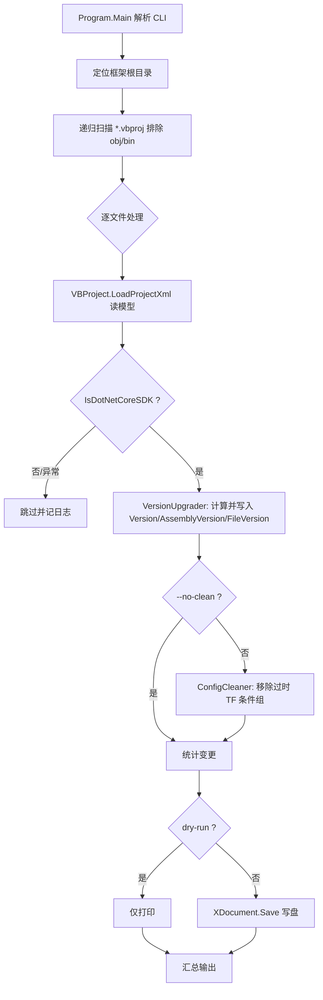

## 产品概述

为已有的 `PkgVersionUpgrade` 命令行工程实现完整的框架 vbproj 批量升级能力：扫描框架目录下所有 `Microsoft.NET.Sdk` 风格项目，统一刷新 nuget 包版本号与程序集版本号，并剔除 TargetFramework 升级后残留的过时条件编译配置，精简项目文件。

## 核心功能

### 1. 项目扫描与加载

- 从框架根目录递归扫描全部 `*.vbproj`，跳过 `obj\`、`bin\` 目录
- 使用 `dev\VisualStudio\VBProject\Project\VBProject.vb` 模块加载（仅解析 XML 的 `LoadProjectXml`，不解析源码，保证性能）
- 仅处理 `IsDotNetCoreSDK = True`（`Sdk="Microsoft.NET.Sdk"`）的项目，43 个 legacy 项目自动跳过

### 2. nuget 包版本号更新（`<Version>`）

- 用户通过命令行参数显式指定版本号时，直接采用该值
- 未指定时，基于**该项目现有 `<Version>` 的 major.minor**，用当前时间戳通过 `CalculateVersion` 计算出完整版本号
- 现有值缺失或无法解析时，major.minor 缺省为 `1.0`
- 所有 SDK 项目均确保存在 `<Version>` 元素（缺失则插入）

### 3. 程序集版本号更新（`<AssemblyVersion>` 与 `<FileVersion>`）

- 两者**都更新**，且**完全不受命令行 `--version` 参数影响**
- 各自以**自身当前值**的 major.minor 为基准，用当前时间通过 `CalculateVersion` 计算
- 现有值缺失或为 `2.33.*` 这类通配符时，major.minor 缺省为 `1.0`
- 所有 SDK 项目均确保存在 `<AssemblyVersion>` 元素（缺失则插入）；`<FileVersion>` 已存在则更新，不主动新增

### 4. 过时编译配置清理

- 仅清理 TargetFramework 相关条件组：删除 `Condition` 中引用 `$(TargetFramework)` 且该 TF 值不在项目 `TargetFramework`/`TargetFrameworks` 声明集合中的整个 `<PropertyGroup>`
- 不动 `Configuration` / `Platform` 条件组；无法解析 TF 的条件组保守保留并告警
- 典型效果：`physics-netcore5.vbproj` 声明 `net10.0` 但残留 62 个 `net6.0`/`net6.0-windows`/`net48` 条件组，将被全部移除；`gr\physics\test\test.vbproj` 声明 `net10.0-windows` 且条件一致，保持原样

### 5. 命令行与输出

- 支持 `--version`/`-v`、`--root`/`-r`、`--dry-run`/`-n`、`--no-clean`、`--help`/`-h`
- `--dry-run` 只打印不写盘；正式执行不生成备份文件
- 逐项目打印版本变更与清理条数，结尾输出汇总（处理数/写入数/移除条件组总数/耗时）

## 技术栈

- 语言/框架：VB.NET，.NET 10（`net10.0`），Microsoft.NET.Sdk 风格控制台工程
- XML 处理：`System.Xml.Linq`（`XDocument` / `XElement` / `XAttribute`）
- 复用的既有模块（**禁止重写算法**）：
- `Microsoft.VisualBasic.ApplicationServices.Development.ApplicationInfoUtils.CalculateVersion(compileTime, major, minor)` —— 来自 `Microsoft.VisualBasic.Core\src\ApplicationServices\VBDev\ApplicationInfoUtils.vb`，`<Extension>` 方法，调用形式 `Now.CalculateVersion(major, minor)`
- `Microsoft.VisualBasic.ApplicationServices.Development.VisualStudio.VBProj.VBProject.LoadProjectXml(path)` —— 来自 `dev\VisualStudio\VBProject\Project\VBProject.vb`
- 工程已引用 `Core.vbproj` 与 `VisualStudio.NET5.vbproj`，**无需新增项目引用**；SDK 风格工程自动 glob 收录 `*.vb`，**无需修改 vbproj**

## 实施思路

**策略**：分析层用 `VBProject` 模型读取，写回层对原始 `XDocument` 做外科手术式原地修改，最后统一保存。

**核心决策与理由**：

1. **不用 `VBProject.Generate()` / `Save()` 回写**（关键）
`Generate()`（VBProject.vb 620-742 行）是按模型重建 XML，只输出 5 类节点：主 PropertyGroup、nuget PropertyGroup、条件 PropertyGroup、Compile ItemGroup、引用 ItemGroup。实测 `Data\BinaryData\HDF5\HDF5.vbproj` 含 `<EmbeddedResource Remove="test\**" />` 与 `<None Remove="test\**" />`，回写时会被静默丢弃；XML 注释同样丢失。此外 `ParseProperties` 以 Condition 字符串为 key 对条件组去重合并（VBProject.vb 440、458 行），Core.vbproj 中存在重复的 `'$(Configuration)|$(Platform)'=='Debug|ARM64'`，基于模型回写必然丢数据。因此**只用模型读，不用于写**。

2. **用 `LoadProjectXml` 而非 `Load`**
`Load()` 会对每个项目递归解析全部 vb 源码文件（VBProject.vb 251-279 行），152 个项目全量解析不可接受；`LoadProjectXml()` 只读 XML。

3. **XML 保真读写**
`XDocument.Load(path, LoadOptions.PreserveWhitespace)` + `doc.Save(path, SaveOptions.DisableFormatting)`。框架内 vbproj 混用 Tab / 空格缩进（Core.vbproj 头部为 Tab、尾部为空格），禁用自动重排可将 diff 降到最小，避免整文件被重写。

4. **版本号一致性**
`Now` 在进程启动、扫描开始前取一次并全程复用，保证同一批次内所有项目的 build/revision 段一致。

## 实施要点（执行细节）

### 根目录定位

默认从程序集所在目录逐级向上回溯，命中"同时存在 `Microsoft.VisualBasic.Core` 子目录"的目录作为框架根（工具位于 `src\framework\vs_solutions\PkgVersionUpgrade`，回溯结果即 `src\framework`）；`--root` 可显式覆盖。

### 扫描

`Directory.EnumerateFiles(root, "*.vbproj", SearchOption.AllDirectories)`，路径段含 `obj` 或 `bin` 的直接跳过。每个文件的加载与改写包在 `Try/Catch` 内，单文件失败只记 error 并继续，**不中断整批处理**。

### 版本计算规则

| 元素 | 新值来源 | major.minor 基准 |
| --- | --- | --- |
| `<Version>` | 有 `--version` 则直接采用；否则 `Now.CalculateVersion(major, minor)` | 自身现有 `<Version>` 值 |
| `<AssemblyVersion>` | 恒为 `Now.CalculateVersion(major, minor)` | 自身现有 `<AssemblyVersion>` 值 |
| `<FileVersion>` | 恒为 `Now.CalculateVersion(major, minor)` | 自身现有 `<FileVersion>` 值 |


- major/minor 解析需容错：`2.33.*` 这类通配符、`10.5.3.8911`、`1.1.25.0`、空串、纯文本都要能处理；解析失败回退 `(1, 0)`
- 从模型读取：`NuGet.Version` 对应 `<Version>`；`Metadata.Other("AssemblyVersion")`、`Metadata.Other("FileVersion")` 对应另两者（依据 `VBProject.vb` 474-478、`SetMetadataProperty` 499 行的分流规则）
- 注意 `ParseProperties` 会跳过空值元素（454 行），空元素读出来是 `Nothing`，需按缺省处理

### 元素写入位置

定位 `<Project>` 下**第一个无 `Condition` 属性的 `<PropertyGroup>`**；元素已存在则改值，不存在则追加到该组末尾。若工程没有任何无条件 PropertyGroup，则新建一个插入到 `<Project>` 首位。

### 条件清理算法

```
有效 TF 集合 = (Metadata.TargetFramework + ";" + Metadata.TargetFrameworks)
               按 ";" 拆分 → 去空 → Trim → OrdinalIgnoreCase 去重
```

遍历所有带 `Condition` 的 `<PropertyGroup>`：

1. Condition 不含 `$(TargetFramework)` → 保留
2. 定位 `$(TargetFramework)` 在条件模板（`'...'=='...'` 左侧）中的 `|` 分段索引，取右侧值同索引段作为目标 TF；单段形式 `Condition="'$(TargetFramework)'=='net6.0'"` 走独立分支
3. 目标 TF 不在有效集合 → `element.Remove()` 并计数
4. 无法解析 TF → 保守保留，仅累加 warning 计数

匹配说明：实测条件值为 `net6.0` / `net6.0-windows` / `net48` / `net10.0-windows`，声明值为 `net10.0` / `net10.0-windows` / `net10.0-windows;net10.0`，**直接 OrdinalIgnoreCase 精确比较即可**，无需做 `net48` ↔ `net4.8` 之类的归一化（声明侧与条件侧写法一致）。

### 兼容性与影响面

- 全部改动限于 `PkgVersionUpgrade` 目录内的新文件；不修改 `VBProject.vb`、`ApplicationInfoUtils.vb` 或任何被扫描框架项目的逻辑代码
- 工具自身的 `PkgVersionUpgrade.vbproj` 也在扫描范围内（位于 `vs_solutions` 下的 SDK 工程），同样会被写入版本号，符合"所有 SDK 项目"的要求
- 无 `--dry-run` 时直接写盘、不生成备份（用户明确选择依赖 git 兜底）
- 日志：仅输出到控制台，不调用 `App.LogException`，避免污染框架日志目录；错误信息包含文件相对路径，便于定位

## 架构设计



模块职责（单一职责、无相互依赖）：

- `Program` —— CLI 解析、编排、汇总输出
- `VersionUpgrader` —— 纯版本号计算 + XML 元素定位/写入（不感知文件系统遍历）
- `ConfigCleaner` —— 纯条件组判定与移除（不感知版本号）

三者通过 `XDocument` 与 `VBProject` 模型实例交互，避免全局变量。

## 目录结构

```
g:\pixelArtist\src\framework\vs_solutions\PkgVersionUpgrade\
├── PkgVersionUpgrade.vbproj   # [不改] SDK 风格工程已自动 glob 收录 *.vb，且已引用 Core 与 VisualStudio.NET5
├── Program.vb                 # [重写] 入口：CLI 解析（--version/-v、--root/-r、--dry-run/-n、--no-clean、--help/-h）、
│                              #        框架根目录回溯定位、*.vbproj 递归扫描（排除 obj/bin）、
│                              #        调用 VBProject.LoadProjectXml 加载并过滤 IsDotNetCoreSDK、
│                              #        编排 VersionUpgrader 与 ConfigCleaner、dry-run 判定、
│                              #        逐项目变更明细 + 结尾汇总（处理数/写入数/移除条件组数/耗时）
├── VersionUpgrader.vb         # [新增] 版本号模块：
│                              #        ParseMajorMinor(ver) -> (major, minor) 容错解析（支持 2.33.* / 空串 / 非法值，回退 1,0）
│                              #        ResolveNugetVersion(cliVersion, currentVersion, now) -> String
│                              #        ResolveAssemblyVersion(currentVersion, now) -> String
│                              #        Apply(doc, ns, upgrades) -> 定位首个无条件 PropertyGroup，
│                              #        更新或追加 <Version> / <AssemblyVersion> / <FileVersion>，返回变更明细
└── ConfigCleaner.vb           # [新增] 条件清理模块：
                               #        GetTargetFrameworkSet(model) -> 有效 TF 集合
                               #        TryExtractTargetFramework(condition) -> 目标 TF（解析失败返回 Nothing）
                               #        Clean(doc, ns, tfSet) -> 移除过时条件组，返回移除数量与告警数量
```

## 关键代码结构

条件解析与清理的核心契约（接口级，实现时按此签名）：

```
Namespace PkgVersionUpgrade

    ''' <summary>单个项目的处理结果，用于 dry-run 预览与汇总统计</summary>
    Public Class UpgradeResult
        Public Property FilePath As String
        Public Property OldVersion As String
        Public Property NewVersion As String
        Public Property OldAssemblyVersion As String
        Public Property NewAssemblyVersion As String
        Public Property OldFileVersion As String
        Public Property NewFileVersion As String
        Public Property RemovedConditions As Integer
        Public Property Warnings As Integer
        Public ReadOnly Property Changed As Boolean
    End Class

    ''' <summary>TargetFramework 条件组清理器</summary>
    Public Module ConfigCleaner

        ''' <summary>从 VBProject 模型收集已声明的目标框架集合（TargetFramework + TargetFrameworks）</summary>
        Public Function GetTargetFrameworkSet(model As VBProject) As IReadOnlyCollection(Of String)

        ''' <summary>
        ''' 从 Condition 中提取 $(TargetFramework) 对应的值。
        ''' 支持 '$(Configuration)|$(TargetFramework)|$(Platform)'=='Debug|net6.0|AnyCPU'
        ''' 与 '$(TargetFramework)'=='net6.0' 两种形式；无法解析返回 Nothing（调用方应保守保留该组）。
        ''' </summary>
        Public Function TryExtractTargetFramework(condition As String) As String

        ''' <summary>就地移除条件中 TF 已失效的 PropertyGroup，返回 (移除数, 告警数)</summary>
        Public Function Clean(doc As XDocument, ns As XNamespace, tfSet As IReadOnlyCollection(Of String)) As (Removed As Integer, Warnings As Integer)
    End Module
End Namespace
```