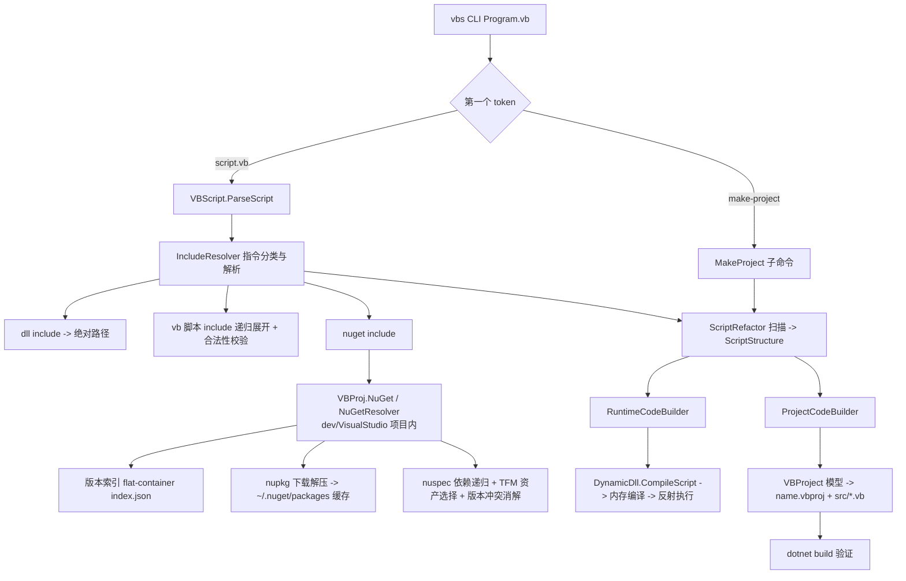

## 产品概述

为 `VBS`（VB.NET 脚本宿主，`vbs` 命令）增强 `#include` 预编译指令的能力，并新增 `make-project` 子命令，使脚本既能引用 dll、其它脚本与 NuGet 包，也能一键“转正”为可编译的正式 vbproj 工程。

## 核心功能

### 1. `#include` 预编译指令扩展

保持现有 `#include "/path/to/assembly.dll"` 能力不变，新增两类引用目标，指令语法统一为 `#include "<target>"`：

**a. 导入其它 VB 脚本**

- 例：`#include "./lib/Helper.vb"`，路径可为绝对路径，或相对于“声明该指令的脚本文件”所在目录的相对路径。
- 语义：直接把目标脚本的代码内容复制到主脚本的顶层命名空间中（类型定义等直接进入生成代码的命名空间，其 `Imports` 提升到生成代码头部），并在编译前于内存中完成合并，不落盘。
- 支持被导入脚本再次 `#include`（递归展开），自动去重；出现循环引用时报错。
- 合法性限制（违反时给出指明文件与原因的错误）：被导入脚本不得包含魔法方法调用、不得包含顶层可执行语句、不得包含顶层 `Function/Sub`、不得包含 `#package/#author/#title/#version` 等元数据定义。
- 被导入脚本自身引用的 dll / NuGet 包一并并入本次编译的引用集合。

**b. 导入 NuGet 程序包**

- 语法：`#include "nuget-package-name"`（自动取最新稳定版）与 `#include "nuget-package-name@version"`（指定版本，支持精确版本与版本范围）。
- 自动解析该包在包内 `.nuspec` 中声明的依赖，并递归解析全部传递依赖，自动完成目标框架匹配（以 `net10.0` 为基准选择最合适的 `lib/<tfm>` 资产）与版本冲突消解。
- 本地缓存：优先复用机器上的 NuGet 全局包目录 `~/.nuget/packages/<id>/<version>/`；缓存缺失时才从 nuget.org 下载并解压写入缓存，二次运行不再联网。
- 解析出的全部 dll 自动全部加入编译引用与运行期依赖探测，脚本内可直接使用包中的类型；包引用的失败原因（包不存在、版本不存在、需要联网但不可达）会以明确信息报告。
- 该能力由 `dev/VisualStudio` 项目提供的可复用 NuGet 客户端实现，见“技术选型”。

### 2. `make-project` 命令行功能

- 用法：`vbs make-project /path/to/script.vb`，可附加 `--verbose`、`--no-build`、`--force` 等开关；不带子命令时 `vbs /path/to/script.vb` 的原有行为完全不变。
- 效果：在脚本所在目录**就地**生成一个正式工程（`<name>.vbproj` + 重构后的正规 VB.NET 源码文件），原始脚本保留作为备份但不会被编译。
- 代码重构为“正规”代码：脚本顶层语句进入标准入口 `Main(args As String())`；脚本顶层函数变为模块内真正的 `Private Function/Sub`（不再是匿名函数）；被顶层函数捕获的顶层变量提升为模块级字段，保证引用关系与执行顺序不破坏；`?args` 参数语法、`let` 声明、元组分解等脚本语法全部展开为等价的标准写法；魔法方法（`ScriptDir/Here/Package/Includes/Locate/Self/...`）实体化为工程内的普通源码文件，使工程脱离脚本引擎也能直接编译运行。
- 指令到工程信息的映射：`#package` → 程序集名称，`#version` → 版本，`#author` → 作者，`#title` → 标题；dll 引用 → 引用项（含本地路径提示）；NuGet 引用 → 包引用（含解析后的版本）；脚本引用 → 列入工程编译的独立源码文件。
- 生成后自动执行 `dotnet restore`/`dotnet build` 并回显结果；本机无 dotnet SDK 时降级为警告而不中断。
- 终端表现：转换过程按阶段输出进度与产出文件清单（解析指令、展开脚本引用、解析 NuGet 包、写出工程文件、构建结果），失败时输出指明原因的错误信息。

## 技术选型

沿用现有工程栈，不引入任何新的 NuGet 依赖：

- 语言/框架：VB.NET，`net10.0`，`LangVersion=16`（`VBS/VBS.vbproj` 现状）
- 编译：`Microsoft.CodeAnalysis.VisualBasic 5.9.0`（Roslyn，内存编译，既有 `DynamicDll.CompileScript`）
- 宿主运行时：既有 `Microsoft.VisualBasic.Core`（`Core.vbproj`，程序集名 `Microsoft.VisualBasic.Runtime`，提供 `CommandLine` 类型）
- 工程模型：既有 `dev/VisualStudio`（`VBProj.VBProject` / `VBProjectMetadata` / `VBPackageReference` / `Generate()` / `Save()`），`VBS.vbproj` 已通过 ProjectReference 引用它
- **NuGet 客户端**：实现在 `dev/VisualStudio/VisualStudio.NET5.vbproj` 项目的 `VBProject/NuGet/` 目录下（命名空间 `VBProj.NuGet`），作为该库的正式可复用能力；`VBS.vbproj` 通过**既有 ProjectReference**（`..\dev\VisualStudio\VisualStudio.NET5.vbproj`）直接复用，无需新增任何引用。该项目已引用 `Microsoft.VisualBasic.Core`（提供 `HttpClientFactory`）且已具备 `System.IO.Compression` / `System.Xml.Linq`（BCL），因此同样不需要新增 NuGet 依赖。NuGet 客户端内部只允许依赖 BCL 与 `Microsoft.VisualBasic.Core`，**不得**反向引用 VBS 宿主类型。
- HTTP：复用既有 `Microsoft.VisualBasic.Net.Http.HttpClientFactory`（`GetStringSync` / `GetStreamSync`，内部已含 UserAgent、代理、超时配置），无需 `HttpClient` 裸写
- 压缩/XML：`System.IO.Compression.ZipFile`（nupkg 解压）+ `System.Xml.Linq`（nuspec / vbproj 读写），均为 BCL

## 实现方案

### 总体策略

把“指令解析”从 `VBScript.ParseScript` 中的两处正则提升为独立的解析层，让 `#include` 成为一个可扩展的引用模型；把 `ScriptRefactor` 的“扫描”与“发射”分离，使同一份扫描结果既能生成运行期代码（现状不变），也能生成工程代码。NuGet 包获取与依赖解析作为通用能力下沉到 `dev/VisualStudio`（`VBProj.NuGet`），VBS 侧只做“指令 → 包解析请求 → 资产 dll 路径集合”的编排。改动集中在 VBS 工程与 dev/VisualStudio 的追加式扩展，对 `Microsoft.VisualBasic.Core` 零改动。

### 关键设计决策

**1. 统一的 `#include` 目标模型与判别规则**
新增 `IncludeDirective`（`Raw` / `ResolvedPath` / `Kind` / `PackageId` / `Version`）与解析器，替换现有单一 dll 正则，判别顺序：

1. 按现有 4 级搜索根（脚本目录、`App.HOME`、`App.HOME/libs`、`App.HOME` 上级 `libs`）尝试解析为本地文件：扩展名为 `.vb` → `Script`；否则 → `Assembly`（dll）；
2. 本地文件解析失败且形如 `id` 或 `id@version`（不含路径分隔符）→ `NuGet`；
3. 仍无法解析 → 保留原始目标并记录诊断（保持现有“找不到就忽略”的宽松语义，但在 `--verbose` 下输出明确告警）。

**2. 脚本 include 的递归展开与校验（复用扫描器，避免重复实现）**
新增 `IncludeResolver`：以“包含它的那个文件所在目录”为基准递归读取 `#include "*.vb"`（绝对路径去重 + 访问栈检测循环），对每个被导入脚本新建一个 `ScriptRefactor` 实例只做“扫描”，复用其既有的块栈判定（`IsTypeBlockStart` / `IsFunctionBlockStart` / `ControlBlockStart` / `DeclaredNamesOf`）；仅当扫描结果中 `_slots` 与 `_funcs` 为空时才接受，否则抛出带文件路径与违规行内容的结构化错误。同时校验被导入文本不含元数据指令与魔法方法名。展开结果（头部 `Imports`、类型块文本、dll 引用、NuGet 引用）作为参数注入主脚本的扫描/发射流程，从而做到“直接复制到主脚本顶层命名空间”。

**3. NuGet 轻量客户端（实现在 `dev/VisualStudio`，`VBProj.NuGet`，零新依赖）**

> 全部实现位于 `dev/VisualStudio/VBProject/NuGet/`，随 `VisualStudio.NET5.vbproj` 的默认 glob 一同编译，**无需修改 vbproj**；对外暴露 `NuGetResolver.Resolve(packageId, versionRange, targetFramework)` 这类纯函数式入口，返回解析后的包节点与资产 dll 路径集合。

- **版本解析**：`GET https://api.nuget.org/v3-flatcontainer/{id-lower}/index.json` 取版本列表；未写 `@version` 时按语义化版本倒序取第一个非 prerelease 版本。
- **下载与缓存**：`GET .../{id-lower}/{version}/{id-lower}.{version}.nupkg`（流式，复用 `HttpClientFactory`）→ 解压到 `~/.nuget/packages/{id-lower}/{version}/`（与 NuGet 全局包目录布局一致，可直接复用别人安装过的包），写入完成标记；已存在且标记存在则直接复用，不联网。下载写临时目录后原子改名，避免中断产生半包。
- **依赖递归**：解析解压出的 `.nuspec` 的 `<dependencies>`／`<group targetFramework="...">`，按“最近 `net10.0`”规则选取依赖组，得到 `(id, versionRange)` 列表做广度优先展开。
- **版本冲突消解**：同一 `id` 被多处要求时取最高版本（与 NuGet 一致，保证可复现）；`VersionRange` 支持 `1.2.3`（最小版本）、`[1.2.3]`（精确）、`[1.0,)`、`[1.0,2.0)`、`(,2.0]` 等常用写法。
- **资产选择**：优先 `lib/<tfm>/*.dll`（`net10.0` > `net9.0` > … > `netstandard2.1` > `netstandard2.0` > `netstandard1.x` 的兼容性排序），`ref/` 仅作参考不用于运行（引用程序集无 IL，无法被运行期 ALC 加载）；`runtimes/<rid>/lib/<tfm>/*.dll` 一并收集；原生资产（`runtimes/*/native/`、`build/`）尽力而为：收集其所在目录并加入本进程的原生库搜索路径（`PATH`）。不使用也不加载非目标 TFm 资产。

**4. `ScriptRefactor` 扫描/发射分离（运行时行为不变）**
把当前散落在对象字段上的扫描结果提升为公开的 `ScriptStructure`（`Headers`、`TypeBlocks`、`Functions`（含**原始**签名与函数体）、`StatementSlots`（含变量名）），并把现有 `BuildCode()` 原样搬为运行期发射器（`RuntimeCodeBuilder`），保证运行期输出逐字节等价。`Refactor(source, includes)` 接受外部注入的头部与类型块。发射器接口化后，工程发射器可按需选择“匿名函数”或“真实函数”两种落位策略。

**5. 工程发射器 `ProjectCodeBuilder`（make-project 的核心）**

- 生成 `Namespace DynamicDll / Module Program`，与运行期保持一致的类型标识；`Main` 换成标准入口 `Public Function Main(argv As String()) As Integer`，内部 `CommandLine.BuildFromArguments(argv, NoSubCommand:=False)` 赋给模块级字段后执行脚本主体（`?args` 沿用 `args("...")` 展开，语义与运行期相同）。
- 顶层函数：由“匿名函数 + 落位求解”改为**模块级 `Private Function/Sub`**，因此不再需要 `PlaceFunctions`/`ResolveSlot`，源码顺序即自然顺序。
- 被顶层函数捕获的顶层变量：用既有的“函数文本 ↔ 声明名集合”正则分析（复用 `DeclaredNamesOf` 与 `ResolveSlot` 的匹配思路）求出捕获集合，把这些 `Dim/let/Const` 提升为模块级字段：`Dim A As Integer = expr` → 字段 `Private A As Integer` + 原语句改写为赋值 `A = expr`；`let x = expr` → `Private x As Object`；`Const` 保持 `Private Const`；`Dim x As New T(...)` → `Private x As T` + `x = New T(...)`。未捕获的顶层变量仍是 `Main` 的局部变量，最大限度保真。
- 魔法方法：直接复用 `Magics.Build(scriptFile, metadata, imports, searchRoots)` 生成的源码段，物化为独立文件，保持脚本内调用无需 import。
- 工程文件：复用 `VBProject` 模型组装（`AssemblyName`←`#package`，`Version`←`#version`，`Authors`←`#author`，`Title`←`#title`，`OutputType=Exe`，`TargetFramework=net10.0`，`LangVersion=16`）；`RootNamespace` 必须显式置为空（否则 VB SDK 默认以项目名作为根命名空间前缀，会与运行期的 `DynamicDll` 命名空间不一致）；原脚本与被导入脚本通过 `CompileExcludes`（即 `<Compile Remove="..."/>`）排除，生成的 `src/*.vb` 交给 SDK 默认 glob 收集（避免显式 `Include` 与默认 glob 重复导致 MSBuild 报重复项）。
- dll 引用：`<Reference Include="<名称>"><HintPath><绝对/相对路径></HintPath><Private>true</Private></Reference>`；需要时把 `.vbproj` 中的相对路径写作相对工程目录的形式。指向脚本引擎自身程序集的 `#include`（如 `#include "vbs.dll"`）会被识别并跳过，避免与本地物化的魔法方法产生类型重定义。
- NuGet 引用：`<PackageReference Include="id" Version="x.y.z" />`（由 `VBProj.NuGet` 解析出的确定版本）。
- 构建验证：`dotnet build <proj>` 子进程执行，实时回显输出；`dotnet` 不存在（`Win32Exception`）时输出警告并仍以成功返回；`--no-build` 跳过。

### 性能与可靠性

- NuGet 解析只在确实出现 NuGet `#include` 时触发；同一个 `(id, version)` 在一次运行内只解析一次（进程内字典缓存），跨运行由 `~/.nuget/packages` 缓存兜底，二次运行零网络。
- nupkg 下载为流式写入磁盘，避免整包驻留内存；仅解压并索引需要的 `lib/runtimes` 条目（其余条目仍解压以保持目录结构与 NuGet 兼容，但只把匹配 TFm 的 dll 送入 `MetadataReference`）。
- 依赖图按 `id` 归并 + 最高版本选定，节点数与边数线性；正则匹配均为单次线性扫描，脚本 include 展开的文本拼接为一次 `StringBuilder` 组装。
- 工程生成写文件走临时文件 + 原子替换（`--force` 控制覆盖已有工程），避免半成品工程。

### 兼容性与影响面控制

- `vbs /path/to/script.vb [args...]` 行为保持不变；新增能力只在出现新的 include 形态时生效。
- `ScriptParseResult.Imports` 语义保持“可用于 `MetadataReference` 与 ALC 探测的 dll 绝对路径集合”，仅把 NuGet 资产与脚本引用的转发依赖一并汇入，`DynamicDll.CompileScript` 与 `ScriptLoadContext` 无需结构性改动（ALC 的探测目录本就从 dll 所在目录推导，天然覆盖 NuGet 缓存目录）。
- 对 `dev/VisualStudio` 的改动是**追加式**：

1. 新增 `VBProject/NuGet/` 目录（NuGet 客户端，命名空间 `VBProj.NuGet`），由项目默认 glob 自动收集，**不需要修改 `VisualStudio.NET5.vbproj`**；
2. `VBProject.vb` 新增 `References` 集合与仅在其非空时才输出的 `<Reference>` 分组，不改变既有 `Generate()` 输出的其他部分，其它使用方（`vs_PDB`、`VBProject` 消费者）不受影响。

- `VBS.vbproj` 已通过 ProjectReference 引用 `VisualStudio.NET5.vbproj`，**无需改动引用关系**，只需在 `VBScript.vb` / `IncludeDirective.vb` 中 `Imports` 对应的 `VBProj.NuGet` 命名空间。

## 架构设计



### 目录结构

```
vs_solutions/
├── dev/VisualStudio/
│   ├── VisualStudio.NET5.vbproj                    # [UNCHANGED] 已引用 Microsoft.VisualBasic.Core；新目录由默认 glob 收集
│   └── VBProject/
│       ├── Project/
│       │   ├── VBProject.vb                        # [MODIFY] 新增 References 集合与 <Reference>+<HintPath> 输出（仅非空时）
│       │   └── ProjectXml.vb                       # [MODIFY] 新增 VBReference 模型（Include/HintPath/Private）
│       └── NuGet/                                  # [NEW] NuGet 轻量客户端（命名空间 VBProj.NuGet）
│           ├── NuGetVersion.vb                     # [NEW] 语义化版本号与版本范围（解析/比较/排序/选取最高版本）
│           ├── NuGetClient.vb                      # [NEW] flat-container 客户端：版本索引、nupkg 流式下载、全局缓存复用与原子写入
│           ├── NuGetResolver.vb                    # [NEW] nuspec 依赖组解析、传递依赖 BFS 展开、TFM 资产选择与冲突消解
│           └── NuGetPackage.vb                     # [NEW] 解析结果模型（id/version/资产 dll/依赖/资产目录）
└── VBS/
    ├── Program.vb                                  # [MODIFY] 第一 token 判别，分发 make-project 或原有运行流程
    ├── README.md                                   # [MODIFY] 补充 #include 新语法、NuGet 缓存说明、make-project 用法
    ├── VBS.vbproj                                  # [MODIFY] 无需新增 ProjectReference（已引用 VisualStudio.NET5.vbproj）
    ├── src/
    │   ├── DynamicDll.vb                           # [MODIFY] 引用收集改用统一的 resolvedAssemblies
    │   ├── MakeProject.vb                          # [NEW] make-project 子命令：编排转换流程、写出工程与源码、调用 dotnet build
    │   └── VBScript/
    │       ├── IncludeDirective.vb                 # [NEW] #include 模型与解析：kind 判别、脚本 include 递归展开与合法性校验、依赖汇总
    │       ├── ScriptStructure.vb                  # [NEW] 扫描结果模型（Headers/TypeBlocks/Functions/StatementSlots），供两种发射器共用
    │       ├── ScriptRefactor.vb                   # [MODIFY] 拆分为扫描阶段 + 运行期发射器；Refactor 接受注入的 includes；运行期输出保持不变
    │       ├── ProjectCodeBuilder.vb               # [NEW] 工程代码发射器：标准 Main、真实 Private Function、捕获变量提升为模块字段
    │       ├── VBScript.vb                         # [MODIFY] 用 IncludeDirective 替换原正则，串联 resolver -> refactor -> parseResult
    │       ├── ScriptParseResult.vb                # [MODIFY] 新增 ScriptIncludes / NuGetPackages / ResolvedAssemblies
    │       └── Magics.vb                           # [MODIFY] Includes() 汇入 NuGet 与脚本转发依赖；搜索根追加 NuGet 资产目录
    └── test/
        ├── test_include_script.vb                  # [NEW] 演示并验证 #include 其它脚本
        ├── lib/Helper.vb                           # [NEW] 被 include 的脚本样例（仅类型定义 + Imports，无顶层语句/魔法方法/元数据）
        ├── test_include_nuget.vb                   # [NEW] 演示并验证 #include "nuget-id@version" 与缓存复用
        └── test_make_project.vb                    # [NEW] make-project 端到端用例（含元数据指令、脚本引用、顶层函数）
```

## 关键代码结构

```
' VBS/src/VBScript/IncludeDirective.vb
Public Enum IncludeKind
    [Assembly]      ' dll 文件
    Script          ' 其它 .vb 脚本
    NuGet           ' nuget 包
End Enum

Public Class IncludeDirective
    Public Property Raw As String           ' 指令原文
    Public Property ResolvedPath As String  ' 本地文件绝对路径(Assembly/Script)
    Public Property Kind As IncludeKind
    Public Property PackageId As String     ' NuGet
    Public Property Version As String       ' NuGet 版本或版本范围, Nothing 表示最新稳定版
    Public Property DeclaredIn As String    ' 声明该指令的脚本文件绝对路径
End Class
```

```
' VBS/src/VBScript/ScriptParseResult.vb（新增属性，原属性保持不变）
''' <summary>被 #include 引入的其它脚本(递归展开后的有序列表)</summary>
Public Property ScriptIncludes As List(Of IncludedScript)
''' <summary>#include 引入的 nuget 包及其解析出的资产 dll（模型来自 VBProj.NuGet）</summary>
Public Property NuGetPackages As List(Of NuGetPackage)
''' <summary>送入 Roslyn MetadataReference 与 ALC 探测的全部 dll 绝对路径(dll + nuget + 脚本转发依赖)</summary>
Public Property ResolvedAssemblies As List(Of String)
```

```
' dev/VisualStudio/VBProject/NuGet/NuGetResolver.vb（VBS 侧唯一入口）
Namespace VBProj.NuGet
    Public Class NuGetResolver
        ''' <summary>
        ''' 解析一个 nuget 包及其全部传递依赖。
        ''' </summary>
        ''' <param name="packageId">包 id</param>
        ''' <param name="versionRange">版本或版本范围; 空/Nothing 表示取最新稳定版</param>
        ''' <param name="targetFramework">目标框架 moniker(如 net10.0)</param>
        Public Shared Function Resolve(packageId As String,
                                       versionRange As String,
                                       Optional targetFramework As String = "net10.0") As NuGetPackage
    End Class
End Namespace
```

```
' dev/VisualStudio/VBProject/Project/ProjectXml.vb
Public Class VBReference
    Public Property [Include] As String     ' 程序集简单名
    Public Property HintPath As String      ' dll 路径(相对或绝对)
    Public Property [Private] As String
End Class
```

## 执行注意事项

- 不得改动 `Microsoft.VisualBasic.Core`：运行期依赖解析完全依靠 `script.Imports` 推导出的 ALC 探测目录，NuGet 资产目录会天然被覆盖。
- **NuGet 客户端位于 `dev/VisualStudio`（`Microsoft.VisualBasic.ApplicationServices.Development.VisualStudio`）项目内**：只允许依赖 BCL 与 `Microsoft.VisualBasic.Core`，**不得**引用 VBS 宿主类型（`VBScriptHost.*`），避免形成循环依赖；VBS 侧统一通过 `VBProj.NuGet` 命名空间调用，`VBS.vbproj` 无需新增 ProjectReference。
- 保持 `ScriptRefactor` 运行期发射输出与现状一致（包括 12 空格缩进、固定 Imports 顺序、`Option` 行），改动后需对照 `--verbose` 输出回归。
- 生成的 vbproj 必须显式 `<RootNamespace></RootNamespace>`，否则 SDK 默认以项目名作前缀，导致脚本里以 `DynamicDll.` 限定的类型引用失效。
- `#include` 路径解析与脚本递归展开都要做大小写不敏感去重与循环检测，避免同一文件重复内联造成类型重定义。
- 下载/解压失败要清理半成品缓存目录，错误信息包含包 id、版本与具体 URL，便于排查；`--verbose` 下打印解析出的全部 dll 路径。
- `dev/VisualStudio` 的改动需保持向后兼容：`<Reference>` 分组只在 `References` 非空时输出，既有 `Generate()` 结果不变。

## Agent Extensions

### Skill

- **lsp-code-analysis**
- Purpose: 在拆分 `ScriptRefactor`（扫描/发射分离）与调整 `ScriptParseResult`、`VBScript.ParseScript`、`CompileScript` 签名前，做语义级影响面分析：查找 `ParseScript`、`CompileScript`、`ScriptRefactor.Refactor`、`ScriptParseResult` 各属性的全部定义与引用点，并确认 `VBProject.Generate()` / `Save()` 的既有调用方（如 `vs_PDB`）不受新增 `References` 影响。
- Expected outcome: 输出准确的引用清单与调用层级，确保运行期执行路径（Program.vb -> ParseScript -> CompileScript -> Run）签名变更后全部调用点同步更新且行为不变。