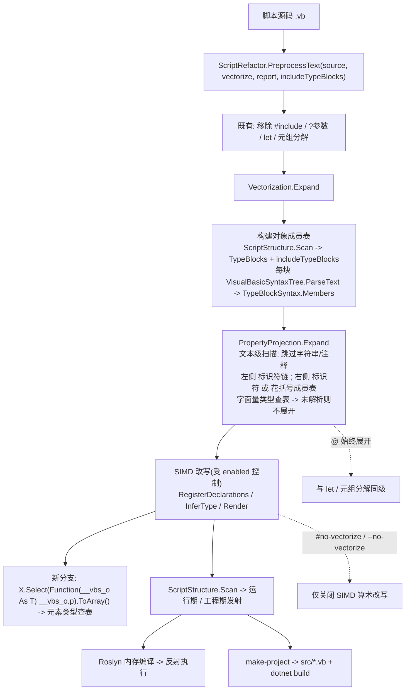

## 产品概述

在 `VBS\VBS.vbproj` 脚本引擎中新增 Perl 风格的**数组投影运算符 `@`**：对对象数组可直接按属性取列，并且取列得到的数组能与既有的 SIMD 向量化能力无缝衔接，脚本无需手写 `Select(...).ToArray()` 与循环。

## 核心特性

- **`@` 单属性投影**：`Dim x = list@x` 重写为 `Dim x = list.Select(Function(__vbs_o As CLRObjectType) __vbs_o.x).ToArray()`；`Dim y = list@y` 同理（`y As String` 时得到 `String()`）。
- **`@` 多属性投影**：`Dim p = list@{x, y}` 重写为 `list.Select(Function(__vbs_o As CLRObjectType) New With {.x = __vbs_o.x, .y = __vbs_o.y}).ToArray()`，得到匿名类型数组；`@{x}` 单成员写法等价于 `@x`（因此仍可参与 SIMD）。
- **与 SIMD 打通**：`Dim z = list@x + {2, 3, 4, 5, 6, 7, 8, 9}` 重写为 `VecAdd(list.Select(Function(__vbs_o As CLRObjectType) __vbs_o.x).ToArray(), VecConvert(Of Integer, Double)({2, 3, 4, 5, 6, 7, 8, 9}))`；取列结果后续的算术运算、逐元素数学函数与聚合归约同样被向量化。
- **结果类型持续传播**：投影结果按属性的声明类型登记（`x As Double` 得 `Double()`、`y As String` 得 `String()`），因此可以继续参与向量化链路（如 `list@x.Sum()`、`list@x * list@x`）。
- **链式投影**：`list@inner@x` 可从右向左依次展开（内层结果作为外层投影的数组来源）。
- **保守展开，绝不猜测**：只有当左侧元素类型与目标成员都能从脚本声明中解析出来（主脚本或被 `#include` 引入脚本的 `Class`/`Structure` 成员声明）时才展开；否则完整保留原文，由 VB 按原有方式报语法错误，不产生任何猜测性代码。
- **与向量化开关解耦**：`@` 属于语法糖，与 `let`、元组分解同级，**始终生效**；`#no-vectorize` / `--no-vectorize` 只关闭 SIMD 算术改写。
- **可观测**：调试模式在既有向量化统计旁额外输出投影展开次数，便于确认与排查。

## 视觉/交互效果

无图形界面。可见差异是：调试模式打印的「重构后代码」中，`list@x` 从无法解析的写法变成一行等价的 `Select(...).ToArray()`；与数组字面量混算时进一步变成一行 `Vec*` 调用。运行输出与手工书写 `Select(...).ToArray()` 的版本逐字一致。

## 已确认的边界

| 边界 | 结论 |
| --- | --- |
| `@` 语义 | 数组投影 + 多属性投影；**不含**标量对象形态（标量请直接写 `obj.x`） |
| 无法判定时 | **不展开**（保留原文报错），不做类型猜测 |
| 与 `--no-vectorize` 关系 | **不关闭** `@` 展开 |
| 类型可见范围 | 主脚本 + `#include` 引入脚本的 `Class`/`Structure` |


## 技术栈

- 宿主引擎：VB.NET / `net10.0`（`VBS/VBS.vbproj`，`RootNamespace=VBScriptHost`，`LangVersion=16`）——沿用现有工程，不引入新框架。
- 语法解析：`Microsoft.CodeAnalysis.VisualBasic` `5.9.0`（工程已有引用）。投影展开是**文本级**前置变换（`@` 不是合法 VB 字符，Roslyn 无法解析），展开后的代码再交给既有 Roslyn 改写器；类型块成员提取则直接复用 Roslyn 语法树。
- 向量化后端：`Microsoft.VisualBasic.Runtime` 的 `Microsoft.VisualBasic.Math.SIMD.Vectorization.Vectorized`（`Vec*` 词汇表），本次**运行时不改动**。
- 复用既有文本工具：`ScriptStructure.SplitTopLevel`（顶层逗号切分，用于 `@{x, y}`）、`ScriptStructure.Scan`（取 `TypeBlocks`）。

## 实现思路

### 总体策略

`@` 展开做成既有 `Vectorization.Expand` 内的一个**行级前置阶段**（在 Roslyn 解析之前），结果类型解析则做成**既有 `InferType` 的一个新分支**。新增一条「对象成员表」数据源，并把类型模型 `ValueTypeInfo` 扩展出一个可选的「用户类型元素名」字段，从而在不触碰任何 SIMD 发射路径的前提下，让投影结果直接进入既有向量化链路。

每行处理流程在既有基础上插入一步：

```
1. 空白/注释/# 指令行            -> 原样返回
2. knownBefore = VectorNames
3. RegisterParameters / RegisterFunctionName
4. >> 新增: line = PropertyProjection.Expand(line, lookup, objectTable)   ' @ 展开(总是执行)
5. statements = ParseStatementsOfLine(line)                              ' Roslyn 桩解析
6. 左->右 RegisterDeclarations
7. 右->左 Render(stmt) 并按偏移回写                                       ' SIMD 改写(受开关控制)
```

### 关键决策与理由

1. **`@` 必须是文本级前置展开（而非 Roslyn 改写）**：`@` 不是合法 VB 字符，含 `@` 的行在 Roslyn 里是词法/语法错误，因此必须在解析之前把 `list@x` 变成 `list.Select(...).ToArray()`。这与既有的 `?"--a"` → `args("--a")`、`let`、元组分解属于同一类处理，位置也一致。
2. **`@` 展开与 `--no-vectorize` 解耦（用户确认）**：因此 `Vectorization.Expand` 的结构要从「开关关闭就整体早退」改为「投影展开总是执行，SIMD 改写受 `enabled` 控制」，并把投影展开次数计入报告的新字段。
3. **`ValueTypeInfo` 增加第三个 `Optional ElementName As String = Nothing`**：`Sub New(kind, isVector)` 增加带默认值的参数是源码兼容的，全仓 `New ValueTypeInfo(...)` 调用点无需修改；`IsNumericVector`/`IsKnown` 的既有语义不变，因此**既有 SIMD 发射逻辑零影响**。
4. **只有「元素类型 + 成员」都能解析才展开（用户确认的保守策略）**：这是本项目一贯的「宁可漏改不可改错」原则的延续。展开失败等价于保持原有行为（原本就是语法错误），不存在行为回归。
5. **成员表用 Roslyn 解析类型块，而不是正则**：`ScriptStructure.TypeBlocks` 给出完整 `Class`/`Structure`/`Interface`/`Module` 块原文，直接 `VisualBasicSyntaxTree.ParseText(block)` 后取 `TypeBlockSyntax.Members` 即可拿到**仅直接成员**（`PropertyStatementSyntax` 自动属性 / `FieldDeclarationSyntax` 字段），天然排除了嵌套在 `Get`/`Function` 体内的伪成员 —— 正则方案（此前已踩过深度计数不可靠的坑）被明确否决。同一引擎也保证了与其它阶段一致的解析语义。
6. **发射 lambda 时写出显式参数类型**（`Function(__vbs_o As CLRObjectType) __vbs_o.x`）：因为保守策略要求「元素类型必须已解析」，展开时该类型名一定已知，而该名称必然处于生成代码的命名空间内（主脚本与 `#include` 脚本的类型都并入 `DynamicDll` 命名空间）。显式类型可消除一类推断失败，并使生成代码自解释，风格与既有「显式泛型实参」决策一致。参数名固定 `__vbs_o`，避免与脚本变量遮蔽冲突。
7. **多属性投影用 `New With {...}`**：该形态在本仓已有实际用例（`dev/VisualStudio/VBProject/NuGet/NuGetResolver.vb:209` 的 `Select(Function(v) New With { ... })`），且生成代码固定 `Option Infer On`，因此安全。
8. **类型感知的 `New T(...)` 判定修正**：既有 `InferCreation` 用「有实参或有初始化器」判定数组，对类不成立（`New Foo(4)` 是构造调用）。本次改为「元素类型是 `ArrayTypeSyntax`，或是数值类型且带上界/初始化器 ⇒ 数组；非数值命名类型 ⇒ 标量（带 `ElementName`）」。这既修正常规语义，又让 `Dim list = {New CLRObjectType With {...}, ...}` 这类字面量能推断出 `ElementName`。
9. **不做数据流分析**：函数返回类型不追踪（`Dim list = GetObjList()` 无法解析元素类型 ⇒ 按用户确认不展开），与既有浅层推断的边界一致，并在文档中明确列出。

### 性能

- 投影展开是 O(行数) 的单次字符扫描（逐字符，跳过字符串与注释），对启动耗时的影响可忽略；只在行内出现 `@` 时才做左侧/右侧匹配。
- 对象成员表在每次 `Vectorization.Expand` 开头构建一次：类型块数量极少（通常 0-3 个），每块一次 Roslyn 解析，成本可忽略；未声明任何 `Class`/`Structure` 时直接跳过。
- 生成代码的运行期开销为零：投影本身就是 `Select(...).ToArray()` 的一次遍历；后续 SIMD 运算仍走 `Vec*` 的 `System.Numerics.Vector` 内核。多属性投影会分配匿名类型对象，属用户显式请求的语义。

### 避免技术债

- **运行时不改动**：本次全部改动集中在宿主侧 `VBS/src/VBScript/Syntax/Vectorization/` 与若干调用点，不新增 `Vec*` 成员、不改生成代码的 `Imports` 注入条件。
- 沿用既有形态：一个预处理模块 + 一个语法分析模块，与 `LetStatement`/`TupleDestructuring`/`Vectorization` 的组织方式完全同构。
- 所有新增参数都带默认值（`PreprocessText`/`Vectorization.Expand`/`VectorizationReport`），既有调用点行为不变。
- 错误处理遵循「不确定即放弃」，绝不抛出异常中断脚本编译；无法解析的类型块被静默跳过（verbose 下可见）。

## 架构设计



## 目录结构

```
e:/codebuddy/GCModeller/src/runtime/sciBASIC#/vs_solutions/VBS/
├── src/VBScript/Syntax/ScriptRefactor.vb      # [MODIFY] PreprocessText 增加 Optional includeTypeBlocks As IEnumerable(Of String) = Nothing
│                                              #   并下传 Vectorization.Expand; Refactor(source) 传入实例自身的 _includeTypes。
├── src/VBScript/Syntax/Vectorization/
│   ├── VectorType.vb                          # [MODIFY] ValueTypeInfo 增加 Optional ElementName As String = Nothing
│                                              #   (新增 IsUserType 判定, ToString 带上类型名); VectorType 增加
│                                              #   TryParseArrayElement(typeName, ByRef name) 辅助与数组字面量元素名的合并规则。
│   ├── ObjectMemberTable.vb                   # [NEW] 对象成员表。职责: 由类型块原文构建 类型名 -> (成员名 -> ValueTypeInfo) 映射。
│   │                                          #   实现: VisualBasicSyntaxTree.ParseText(block) -> TypeBlockSyntax.BlockStatement.Identifier
│   │                                          #   取类型名, 遍历 .Members: PropertyStatementSyntax(自动属性, 跳过带 ParameterList 的索引属性)
│   │                                          #   与 FieldDeclarationSyntax(遍历 Declarators, 复用 ValueTypeInfo 的解析规则)。
│   │                                          #   提供 TryGetMember(typeName, memberName, ByRef info) As Boolean(大小写不敏感),
│   │                                          #   以及 Create(typeBlocks) 工厂; 语法有错的块静默跳过; 同名成员首次声明优先。
│   ├── PropertyProjection.vb                  # [NEW] @ 投影展开。职责: 文本级把 list@x / list@{x, y} 展开为标准 VB 表达式。
│   │                                          #   实现要点: (1) 逐字符扫描, 遇 "'" 到行尾视为注释、遇双引号按 VB 规则(连写两个双引号表转义)
│   │                                          #   整段跳过字符串(含 $"..." 插值串); (2) 左侧操作数从 @ 向前取 [A-Za-z0-9_.] 链并查类型表,
│   │                                          #   必须命中 IsVector 且 ElementName 非空; (3) 右侧取标识符或花括号成员表
│   │                                          #   (成员用 ScriptStructure.SplitTopLevel 切分); (4) 逐个成员查 ObjectMemberTable,
│   │                                          #   任一成员缺失则整处不展开; (5) 单成员 -> Select(Function(__vbs_o As T) __vbs_o.m).ToArray(),
│   │                                          #   多成员 -> Select(Function(__vbs_o As T) New With {.m1 = __vbs_o.m1, ...}).ToArray();
│   │                                          #   (6) 从右向左处理, 并把已插入的展开区间纳入后续左侧扫描, 以支持链式 list@inner@x;
│   │                                          #   (7) 输出展开次数; 对外暴露
│   │                                          #   Expand(line, lookup As Func(Of String, ValueTypeInfo), table, ByRef expansions) As String。
│   ├── VectorExpressionRewriter.vb            # [MODIFY] 构造函数增加 Optional objectTypes As ObjectMemberTable = Nothing;
│   │                                          #   RewriteLine 在解析之前调用 PropertyProjection.Expand(并把它计入报告);
│   │                                          #   InferType 增加分支: 识别 X.ToArray() / X.Select(...).ToArray() 形态 -> 投影元素类型
│   │                                          #   (优先用 lambda 的显式参数类型, 回退到接收者的 ElementName);
│   │                                          #   ResolveTypeSyntax / InferCreation / RegisterParameters 支持非数值命名类型
│   │                                          #   (数组 -> IsVector + ElementName, 标量 -> ElementName);
│   │                                          #   SetType 对携带 ElementName 的类型也登记; InferArrayLiteral 支持元素为
│   │                                          #   用户类型标量的字面量; 新增 TellProjection 计数入口。
│   ├── Vectorization.vb                       # [MODIFY] VectorizationReport 增加 Projections As Integer;
│   │                                          #   Expand 增加 Optional typeBlocks As IEnumerable(Of String) = Nothing,
│   │                                          #   构建 ObjectMemberTable 并传给 rewriter; 结构调整为
│   │                                          #   「@ 展开恒执行、SIMD 改写受 enabled 控制」。
│   └── SimdVocabulary.vb                      # [不变] 
├── src/VBScript/VBScript.vb                   # [MODIFY] ParseScript 调 PreprocessText 时传入 includes.TypeBlocks;
│                                              #   PrintVectorization 追加投影展开次数输出。
├── src/VBScript/IncludeDirective/IncludeDirective.vb   # [MODIFY] 调用点签名不变(vectorize:=False), 行为随之变为「仍做 @ 展开」
├── src/VBScript/ProjectCodeBuilder.vb         # [MODIFY] BuildIncludedSources 调用点签名不变(vectorize:=False), 行为同上,
│                                              #   保证与运行期路径一致
├── test/
│   ├── test_projection.vb                     # [NEW] 需求原型: CLRObjectType 数组的 list@x / list@y, 打印结果与 TypeName
│   ├── test_projection_simd.vb                # [NEW] 与数组字面量混算: list@x + {2,3,...} 与 list@x.Sum()/list@x * list@x
│   ├── test_projection_multi.vb               # [NEW] 多属性 list@{x, y} 与单成员 list@{x}、链式 list@inner@x
│   ├── test_projection_scope.vb               # [NEW] #include 引入脚本中的 Class 定义 + 保守策略(无法解析时不展开的行为)
│   └── test_projection_off.vb                 # [NEW] #no-vectorize 下 @ 仍展开、但 SIMD 不生效的对照
└── README.md                                  # [MODIFY] 新增「@ 数组投影」章节: 展开规则、类型表来源、链式与多属性、
                                               #   与向量化的衔接、保守策略与已知限制、源码结构表补充
```

## 关键代码结构

仅列出跨模块需要精确约定的两处接口：

```
' 类型模型扩展(VectorType.vb): 第三个参数带默认值 => 既有调用点全部源码兼容
Public Structure ValueTypeInfo
    Public ReadOnly Kind As NumericKind
    Public ReadOnly IsVector As Boolean
    ''' <summary>用户类型(Class/Structure)的元素名; 非数值类型时用于 @ 投影与成员查表</summary>
    Public ReadOnly ElementName As String

    Public Sub New(kind As NumericKind, isVector As Boolean, Optional elementName As String = Nothing)
        Me.Kind = kind
        Me.IsVector = isVector
        Me.ElementName = elementName
    End Sub

    ''' <summary>ElementName 非空即表示这是一个用户类型(而非基元数值类型)</summary>
    Public ReadOnly Property IsUserType As Boolean
End Structure
```

```
' 对象成员表(ObjectMemberTable.vb)
Public Class ObjectMemberTable
    ''' <summary>由类型块原文(主脚本 TypeBlocks + #include 引入脚本 TypeBlocks)构建成员表</summary>
    Public Shared Function Create(typeBlocks As IEnumerable(Of String)) As ObjectMemberTable

    ''' <summary>按类型名与成员名查表(大小写不敏感); 查不到返回 False</summary>
    Public Function TryGetMember(typeName As String, memberName As String, ByRef info As ValueTypeInfo) As Boolean
End Class

' @ 投影展开(PropertyProjection.vb)
Public Module PropertyProjection
    ''' <summary>
    ''' 文本级展开 list@x / list@{x, y}; 只依据 lookup 与 table 判定, 任何不确定都不展开。
    ''' </summary>
    ''' <param name="lookup">变量名 -> 浅层类型(由 VectorExpressionRewriter 提供, 未登记返回 Unknown)</param>
    ''' <param name="expansions">本次展开的处数</param>
    Public Function Expand(line As String, lookup As Func(Of String, ValueTypeInfo),
                           table As ObjectMemberTable, ByRef expansions As Integer) As String
End Module
```

## Agent Extensions

### SubAgent

- **code-explorer**
- Purpose: 实施阶段做两轮只读核查。第一轮：核对 `TypeBlockSyntax.Members` 下的节点类型（`PropertyStatementSyntax` / `FieldDeclarationSyntax`）与本计划假设一致，并给出本仓中「自动属性 / 字段 / 完整属性 / 索引属性」在语法树里的实际节点类型清单，避免类型名或属性名假设错误。第二轮（完成后）：逐条核对本次新增调用点与签名（`PreprocessText` 新参数、`Vectorization.Expand` 新参数、`VectorizationReport.Projections`、`ObjectMemberTable.Create`/`TryGetMember`、`PropertyProjection.Expand`、`VectorRewriter` 构造函数）在仓库内无遗漏、无签名不匹配，并复核 `New ValueTypeInfo(...)` 既有点位仍全部兼容。
- Expected outcome: 产出「Roslyn 节点类型 ↔ 声明形态」对照结论与「新增成员 ↔ 调用点」清单，使类型假设错误、参数遗漏、签名不匹配在提交前被消除。

## Agent Extensions

### SubAgent

- **code-explorer**
- Purpose: 两轮只读核查。第一轮在实现前核对 `TypeBlockSyntax.Members` 的节点形态（`PropertyStatementSyntax`/`FieldDeclarationSyntax`，含自动属性、字段、完整属性、索引属性）与计划假设一致；第二轮在实现后逐条核对本次新增的签名与全部调用点（`PreprocessText`/`Vectorization.Expand`/`VectorizationReport.Projections`/`ObjectMemberTable.Create`/`PropertyProjection.Expand`/改写器构造函数），并复核既有 `New ValueTypeInfo(...)` 调用点兼容性。
- Expected outcome: 产出「Roslyn 节点类型 ↔ VB 声明形态」对照表与「新增成员 ↔ 调用点」清单，消除类型假设错误、参数遗漏与签名不匹配。