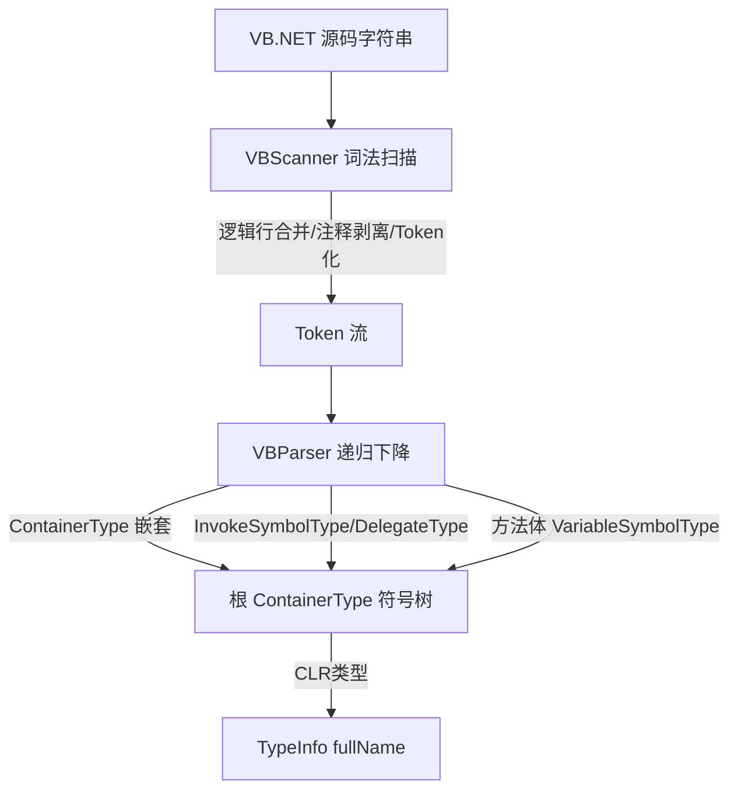

## 用户需求

在 VBLang 项目中新增一个 VB.NET 源代码符号解析模块，从给定的 VB.NET 源代码文本字符串中解析出符号树。

## 产品概述

提供一套「词法扫描 + 递归下降解析」的 VB.NET 源码解析器，将源码文本转换为结构化的符号对象树。CLR 类型信息统一使用 `Microsoft.VisualBasic.Scripting.MetaData.TypeInfo` 存储。

## 核心特性

- 解析容器类型 ContainerType：Class、Module、Structure、Enum、Interface、Namespace；支持嵌套类型与继承/实现子句（Inherits / Implements）及泛型参数（Of T）。
- 解析成员符号 InvokeSymbolType：Function、Sub、Operator、Sub New、Property；提取参数列表（含类型）与返回值类型，并解析方法体内的局部变量。
- 解析委托声明 Delegate 为 DelegateType（成员符号），提取参数与返回值类型。
- 解析成员方法体（到 End XXX 之间）内的 Dim/Static/Const 局部变量为 VariableSymbolType。
- 覆盖修饰符（Public/Private/Shared/Overloads/Overrides 等）、泛型 Of T、特性（&lt;Attr()&gt;）与 XML 文档注释（'''），作为符号的附加元数据。
- 所有类型引用以 TypeInfo 表达（fullName 取自源码类型名文本，assembly/reference 在源码阶段置空，可由 isSystemKnownType 判定已知类型）。

## 技术栈选择

- 语言/框架：VB.NET（.NET 10），沿用现有 SDK 风格 VBLang.vbproj，RootNamespace=VBLang。
- 依赖复用：直接复用已 ProjectReference 的 Microsoft.VisualBasic.Core 中 `Scripting.MetaData.TypeInfo`（即用户指定的 Type.vb 对象），不引入任何第三方依赖。
- 新增代码组织：新建 `VBLang.Syntax` 命名空间子目录，保持与现有 `LanguageSymbolType.vb` 同项目共存。

## 实现方案

采用「词法扫描器 + 递归下降解析器」两段式架构：

1. 词法扫描：对源码做字符级扫描，先处理行继续符 `_`（需判断其不在字符串/注释内），剥离 `'` 行注释（保留字符串内 `'`），收集 `'''` XML 文档行；再切分为标识符、关键字、字符串/字符/数字字面量、标点等 Token。语句级特性块 `<...>`（需平衡 `()` 与 `<>`）被整体识别并与紧随的 XML 文档一并挂到下一个声明。
2. 递归下降解析：从 Token 流构建符号树。入口 `Parse(source As String) As ContainerType` 返回一个合成根容器（Namespace 类型，空名），其 InternalNested/Members 容纳顶层符号。解析过程在遇到 `End Class/Module/...` 时回退并挂回父容器，天然支持任意深度嵌套。

- 关键决策：优先扩展现有 `LanguageSymbolType` 基类（新增 Modifiers/Attributes/XmlDoc）与 `ContainerType`（新增 InheritsType/ImplementsInterfaces/枚举基类型），不改动 `SymbolType` 枚举与现有构造函数语义，delegate 继续走 `DelegateType`，保持向后兼容。
- 性能：单次线性扫描（O(N)），Token 流仅在解析时顺序前进，无回溯重扫；行继续符合并仅一次。对超长源码主要瓶颈在字符串/注释状态跟踪，采用单遍状态机即可满足。
- 避免技术债：复用现有数据模型与 TypeInfo 构造（无参 Sub New + fullName 属性），不重复造类型系统。

## 实现备注

- 向后兼容：仅向 `LanguageSymbolType`/`ContainerType` 增加可选属性（字符串/数组，默认空），不修改既有属性与 `ContainerType.New` 的校验逻辑（保持对 Delegate/Variable/Event 抛异常）。
- 类型名解析：当源码出现泛型如 `List(Of T)` 时，fullName 保留原文文本（如 `List(Of T)`）；符号级 `GenericTypeArguments` 存为已解析的 `TypeInfo()` 数组。
- 类型级字段（如 `Public X As Y`）：枚举已有 Field 但无对应类，按最佳努力以 `VariableSymbolType` 收录进容器 Members 并标注，避免数据丢失（如需专用 FieldType 可后续扩展）。
- 健壮性：遇到无法识别的声明（如 LINQ 查询、XML 字面量、部分语句）跳过该行并继续，保证解析器不崩溃。

## 架构设计



## 目录结构

```
g:\DevAgent\src\Languages\VBLang\
├── LanguageSymbolType.vb      # [MODIFY] 扩展数据模型：基类增 Modifiers/Attributes/XmlDoc；
│                              #          ContainerType 增 InheritsType(As TypeInfo)、
│                              #          ImplementsInterfaces(As TypeInfo())、EnumBaseType(As TypeInfo)；
│                              #          保持 SymbolType 枚举与现有构造函数不变。
└── Syntax\
    ├── VBToken.vb            # [NEW] Token 结构及 TokenKind 枚举（Keyword/Identifier/String/
    │                        #        CharLiteral/Number/Punctuation/XmlDoc/Attribute），
    │                        #        记录文本与位置，供扫描器与解析器共享。
    ├── VBScanner.vb         # [NEW] 词法扫描器：处理行继续符、字符串/字符/注释状态机，
    │                        #        收集 XML 文档与特性块，输出 Token 列表与待挂载元数据。
    ├── VBParser.vb          # [NEW] 递归下降解析器：公开 Function Parse(source As String) As ContainerType；
    │                        #        解析 ContainerType（含嵌套/Inherits/Implements/Of T）、
    │                        #        成员 InvokeSymbolType/DelegateType、方法体 VariableSymbolType，
    │                        #        使用 TypeInfoHelper 构造类型引用。
    └── TypeInfoHelper.vb    # [NEW] 辅助方法：Function TypeRef(name As String) As TypeInfo，
    │                        #        由类型名文本构造 TypeInfo（fullName=name，assembly/reference 置空），
    │                        #        并提供泛型参数 (Of T) 解析为 TypeInfo()。
```

## 关键代码结构

```
' VBToken.vb —— Token 与种类定义（供 Scanner/Parser 共用）
Public Enum TokenKind
    Keyword, Identifier, [String], CharLiteral, Number, Punctuation, XmlDoc, Attribute
End Enum

Public Structure Token
    Public Kind As TokenKind
    Public Text As String
    Public Line As Integer
End Structure

' VBParser.vb —— 公开入口签名
Public Module VBParser
    ''' <summary>
    ''' 解析 VB.NET 源码字符串，返回合成根 ContainerType（Namespace 类型），其
    ''' InternalNested/Members 容纳顶层符号树。
    ''' </summary>
    Public Function Parse(source As String) As ContainerType
End Module
```